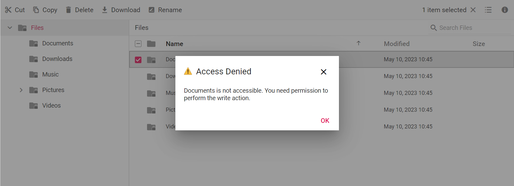

# Access Control in Blazor File Manager

Access control in the [Blazor File Manager](https://www.syncfusion.com/blazor-components/blazor-file-manager) allows you to restrict user actions by defining permissions for files and folders. This security feature lets you control who can read, write, download, upload, or copy specific content based on user roles.

By configuring access rules on the server-side file system provider, the File Manager automatically enforces the permissions: restricted toolbar and context menu items are hidden or disabled, denied operations are blocked on the server, and unauthorized files and folders can be hidden from the view.

* [Purpose and Benefits](#purpose-and-benefits)
* [Access Rules](#access-rules)
* [Permissions](#permissions)
* [Implementation Steps](#implementation-steps)
* [Permission Behavior](#permission-behavior)
* [Use Cases](#use-cases)
* [Best Practices](#best-practices)

## Purpose and Benefits

Access control secures the files and folders managed by the Blazor File Manager by allowing you to grant or revoke specific operations per role. The key benefits are:

* **Role-based security** — Define distinct permissions for roles such as `Administrator`, `Document Manager`, and `Default User` so each user only sees and acts on the content they are permitted to access.
* **Granular control** — Apply permissions at the file, folder, extension, or path-pattern level (for example, allow reading `.png` files but deny writing them).
* **Server-enforced restrictions** — Permissions are evaluated by the file system provider, so denied operations are blocked even if a user crafts a direct request to the backend.
* **Consistent UX** — The Blazor File Manager UI automatically hides or disables the toolbar and context menu items that the current role is not permitted to perform, providing a clean, role-appropriate interface.
* **Multi-tenant readiness** — Combine role-based rules with different file system providers to isolate content per tenant in collaborative workspaces.

## Access Rules

Access rules define the security permissions for folders and files in the File Manager. The file system provider's `SetRules()` method is the foundation for implementing these rules in your application.

To set up access rules for folders (including their files and sub-folders) and individual files, use the `SetRules()` method in the file provider and pass an `AccessDetails` object containing a list of `AccessRule` entries. The rules determine which operations are allowed for specific paths and user roles.

The following table represents the `AccessRule` properties available for files and folders:

| **Property** | **Applicable to file** | **Applicable to folder** | **Description** |
| --- | --- | --- | --- |
| Copy | Yes | Yes | Allows access to copy a file or folder. |
| Read | Yes | Yes | Allows access to read a file or folder. |
| Write | Yes | Yes | Allows permission to write (create, rename, or delete) a file or folder. |
| WriteContents | No | Yes | Allows permission to write the content of a folder. |
| Download | Yes | Yes | Allows permission to download a file or folder. |
| Upload | No | Yes | Allows permission to upload to the folder. |
| Path | Yes | Yes | Specifies the path to which the rules apply. Wildcards such as `*` and `/*.*` are supported. |
| Role | Yes | Yes | Specifies the role to which the rule is applied. |
| IsFile | Yes | Yes | Specifies whether the rule targets a file (`true`) or a folder (`false`). |

### Path patterns

The `Path` property supports wildcards so a single rule can cover many items:

| **Pattern** | **Matches** |
| --- | --- |
| `*` | All folders (used for the broad folder rule). |
| `/` | The root folder only. |
| `/*.*` | All files in the root and its sub-folders. |
| `/Documents` | A specific folder named `Documents`. |
| `/Documents/*` | All sub-folders inside the `Documents` folder. |
| `/Documents/*.*` | All files inside the `Documents` folder and its sub-folders. |
| `/*.png` | All `.png` files regardless of location. |
| `/Pictures/Employees/Adam.png` | A single specific file. |

N> Place the most specific rule last. When multiple rules match the same path, the **last matching rule wins**, so order rules from general to specific.

### Administrator role example

The following example represents the access rules for an `Administrator` role:

```csharp
// Administrator
// Access Rules for File
new AccessRule { Path = "/*.*", Role = "Administrator", Read = Permission.Allow, Write = Permission.Allow,
Copy = Permission.Allow, Download = Permission.Allow, IsFile = true },

// Access Rules for folder
new AccessRule { Path = "*", Role = "Administrator", Read = Permission.Allow, Write = Permission.Allow,
Copy = Permission.Allow, WriteContents = Permission.Allow, Upload = Permission.Allow, Download = Permission.Deny,
IsFile = false },
```

### Default User role example

The following example represents the access rules for a `Default User` role with all file operations denied:

```csharp
// Default User
// Access Rules for File
new AccessRule { Path = "/*.*", Role = "Default User", Read = Permission.Deny, Write = Permission.Deny,
Copy = Permission.Deny, Download = Permission.Deny, IsFile = true },

// Access Rules for folder
new AccessRule { Path = "*", Role = "Default User", Read = Permission.Deny, Write = Permission.Deny,
Copy = Permission.Deny, WriteContents = Permission.Deny, Upload = Permission.Deny, Download = Permission.Deny,
IsFile = false },
```

## Permissions

This section explains how to apply security permissions to File Manager files or folders using access rules. The File Manager uses two permission values:

| **Value** | **Description** |
| --- | --- |
| `Permission.Allow` | Allows the role to perform the read, write, copy, and download operations defined by the rule. |
| `Permission.Deny` | Denies the role from performing the read, write, copy, and download operations defined by the rule. |

Use the `Role` property to apply created roles to the File Manager. After assigning roles, the File Manager displays folders or files and allows operations based on the permissions defined for each role.

## Implementation Steps

Access control is enforced on the server side by the file system provider that backs the Blazor File Manager. The following steps show how to configure access rules using the [Physical file system provider](./physical-file-system-provider.md); the same `SetRules()` approach applies to the [Azure](./azure-cloud-file-system-provider.md), [Amazon S3](./amazon-S3-cloud-file-provider.md), [SQL](./SQL-database-file-system-provider.md), and other supported providers.

### 1. Clone and configure the file system provider

Clone the Physical file system provider and open it in Visual Studio.

```

git clone https://github.com/SyncfusionExamples/ej2-aspcore-file-provider ej2-aspcore-file-provider

cd ej2-aspcore-file-provider

```

### 2. Define access rules in the controller

In the file provider controller, create an `AccessDetails` object that holds the list of `AccessRule` entries and the role being assigned. Pass this object to the provider's `SetRules()` method in the controller constructor.

```csharp

using System;
using System.Collections.Generic;
using Syncfusion.EJ2.FileManager.Base;
using Syncfusion.EJ2.FileManager.PhysicalFileProvider;
using Microsoft.AspNetCore.Mvc;
using Microsoft.AspNetCore.Hosting;
using Microsoft.AspNetCore.Http;
using Microsoft.AspNetCore.Http.Features;

namespace WebApplication.Controllers
{
    public class FileManagerAccessController : Controller
    {
        public PhysicalFileProvider operation;
        public string basePath;
        // Root Path in which files and folders are available.
        string root = "wwwroot\\Files";

        public FileManagerAccessController(IHostingEnvironment hostingEnvironment)
        {
            // Map the path of the files to be accessed with the host
            this.basePath = hostingEnvironment.ContentRootPath;
            this.operation = new PhysicalFileProvider();
            // Assign the mapped path as root folder
            this.operation.RootFolder(this.basePath + "\\" + this.root);
            // Set access rules for folder and file access
            this.operation.SetRules(GetRules());
        }

        // Build the access rules applied to the File Manager
        public AccessDetails GetRules()
        {
            AccessDetails accessDetails = new AccessDetails();
            List<AccessRule> Rules = new List<AccessRule>
            {
                // File rules for Default User - deny all file operations
                new AccessRule { Path = "/*.*", Role = "Default User", Read = Permission.Deny, Write = Permission.Deny, Copy = Permission.Deny, Download = Permission.Deny, IsFile = true },
                // File rules for Administrator - allow all file operations
                new AccessRule { Path = "/*.*", Role = "Administrator", Read = Permission.Allow, Write = Permission.Allow, Copy = Permission.Allow, Download = Permission.Allow, IsFile = true },
                // File rules for Document Manager - deny by default, allow only in /Documents
                new AccessRule { Path = "/*.*", Role = "Document Manager", Read = Permission.Deny, Write = Permission.Deny, Copy = Permission.Deny, Download = Permission.Deny, IsFile = true },
                new AccessRule { Path = "/Documents/*.*", Role = "Document Manager", Read = Permission.Allow, Write = Permission.Allow, Copy = Permission.Allow, Download = Permission.Allow, IsFile = true },
                // Folder rules for Default User
                new AccessRule { Path = "*", Role = "Default User", Read = Permission.Deny, Write = Permission.Deny, Copy = Permission.Deny, WriteContents = Permission.Deny, Upload = Permission.Deny, Download = Permission.Deny, IsFile = false },
                new AccessRule { Path = "/", Role = "Default User", Read = Permission.Allow, Write = Permission.Deny, Copy = Permission.Deny, WriteContents = Permission.Deny, Upload = Permission.Deny, Download = Permission.Deny, IsFile = false },
                // Folder rules for Administrator
                new AccessRule { Path = "*", Role = "Administrator", Read = Permission.Allow, Write = Permission.Allow, Copy = Permission.Allow, WriteContents = Permission.Allow, Upload = Permission.Allow, Download = Permission.Deny, IsFile = false },
                new AccessRule { Path = "/", Role = "Administrator", Read = Permission.Allow, Write = Permission.Deny, Copy = Permission.Allow, WriteContents = Permission.Allow, Upload = Permission.Allow, Download = Permission.Deny, IsFile = false },
                // Folder rules for Document Manager
                new AccessRule { Path = "*", Role = "Document Manager", Read = Permission.Deny, Write = Permission.Deny, Copy = Permission.Deny, WriteContents = Permission.Deny, Upload = Permission.Deny, Download = Permission.Deny, IsFile = false },
                new AccessRule { Path = "/", Role = "Document Manager", Read = Permission.Allow, Write = Permission.Deny, Copy = Permission.Deny, WriteContents = Permission.Deny, Upload = Permission.Deny, Download = Permission.Deny, IsFile = false },
                new AccessRule { Path = "/Documents", Role = "Document Manager", Read = Permission.Allow, Write = Permission.Deny, Copy = Permission.Allow, WriteContents = Permission.Allow, Upload = Permission.Allow, Download = Permission.Deny, IsFile = false },
                new AccessRule { Path = "/Documents/*", Role = "Document Manager", Read = Permission.Allow, Write = Permission.Allow, Copy = Permission.Allow, WriteContents = Permission.Allow, Upload = Permission.Allow, Download = Permission.Allow, IsFile = false },
            };
            accessDetails.AccessRules = Rules;
            // The Role value identifies the role to apply for the current request
            accessDetails.Role = "Document Manager";
            return accessDetails;
        }

        public object FileOperations([FromBody] FileManagerDirectoryContent args)
        {
            // Protect the root folder from being deleted or renamed
            if (args.Action == "delete" || args.Action == "rename")
            {
                if ((args.TargetPath == null) && (args.Path == ""))
                {
                    FileManagerResponse response = new FileManagerResponse();
                    ErrorDetails er = new ErrorDetails
                    {
                        Code = "401",
                        Message = "Restricted to modify the root folder."
                    };
                    response.Error = er;
                    return this.operation.ToCamelCase(response);
                }
            }
            switch (args.Action)
            {
                case "read":
                    return this.operation.ToCamelCase(this.operation.GetFiles(args.Path, args.ShowHiddenItems));
                case "delete":
                    return this.operation.ToCamelCase(this.operation.Delete(args.Path, args.Names));
                case "copy":
                    return this.operation.ToCamelCase(this.operation.Copy(args.Path, args.TargetPath, args.Names, args.RenameFiles, args.TargetData));
                case "move":
                    return this.operation.ToCamelCase(this.operation.Move(args.Path, args.TargetPath, args.Names, args.RenameFiles, args.TargetData));
                case "details":
                    return this.operation.ToCamelCase(this.operation.Details(args.Path, args.Names));
                case "create":
                    return this.operation.ToCamelCase(this.operation.Create(args.Path, args.Name));
                case "search":
                    return this.operation.ToCamelCase(this.operation.Search(args.Path, args.SearchString, args.ShowHiddenItems, args.CaseSensitive));
                case "rename":
                    return this.operation.ToCamelCase(this.operation.Rename(args.Path, args.Name, args.NewName));
            }
            return null;
        }

        public IActionResult Upload(string path, IList<IFormFile> uploadFiles, string action)
        {
            FileManagerResponse uploadResponse;
            uploadResponse = operation.Upload(path, uploadFiles, action, null);
            return Content("");
        }

        public IActionResult Download(string downloadInput)
        {
            FileManagerDirectoryContent args = JsonConvert.DeserializeObject<FileManagerDirectoryContent>(downloadInput);
            return this.operation.Download(args.Path, args.Names);
        }

        public IActionResult GetImage(FileManagerDirectoryContent args)
        {
            return this.operation.GetImage(args.Path, args.Id, true, null, args.Data);
        }
    }
}

```

N> The `Role` value in `AccessDetails` identifies the role applied for incoming requests. In a production application, resolve this value from the authenticated user's claims or role manager instead of hard-coding it.

### 3. Bind the Blazor File Manager to the access-control endpoint

Point the `FileManagerAjaxSettings` of the Blazor File Manager to the controller endpoint that has the access rules configured. The File Manager will then enforce the configured permissions in the UI.

```cshtml

@using Syncfusion.Blazor.FileManager

<SfFileManager TValue="FileManagerDirectoryContent">
    <FileManagerAjaxSettings Url="https://physical-service.syncfusion.com/api/FileManagerAccess/FileOperations"
                             UploadUrl="https://physical-service.syncfusion.com/api/FileManagerAccess/Upload"
                             DownloadUrl="https://physical-service.syncfusion.com/api/FileManagerAccess/Download"
                             GetImageUrl="https://physical-service.syncfusion.com/api/FileManagerAccess/GetImage">
    </FileManagerAjaxSettings>
</SfFileManager>

```

> The URLs above point to Syncfusion's publicly hosted demo file-provider service. In production, replace them with the base URL of your own hosted file-provider controller (for example, `https://localhost:{port}/api/FileManagerAccess/...`).

## Permission Behavior

The following examples show how to allow or deny permissions based on file or folder access rules.

### Deny write permission for the Administrator role

```csharp
// For file
new AccessRule { Path = "/*.*", Role = "Administrator", Read = Permission.Allow, Write = Permission.Deny, IsFile = true },

// For folder
new AccessRule { Path = "*", Role = "Administrator", Read = Permission.Allow, Write = Permission.Deny, IsFile = false },
```

### Deny write permission for a specific folder or file

```csharp
// Deny writing for a particular folder
new AccessRule { Path = "/Documents", Role = "Document Manager", Read = Permission.Allow, Write = Permission.Deny,
Copy = Permission.Allow, WriteContents = Permission.Deny, Upload = Permission.Deny, Download = Permission.Deny, IsFile = false },

// Deny writing for a particular file
new AccessRule { Path = "/Pictures/Employees/Adam.png", Role = "Document Manager", Read = Permission.Allow,
Write = Permission.Deny, Copy = Permission.Deny, Download = Permission.Deny, IsFile = true },
```

### Deny write and upload permissions in the root folder

```csharp
// Folder rule
new AccessRule { Path = "/", Role = "Document Manager", Read = Permission.Allow, Write = Permission.Deny,
Copy = Permission.Deny, WriteContents = Permission.Deny, Upload = Permission.Deny, Download = Permission.Deny, IsFile = false },
```

### Effect on the UI

When access control is configured, the Blazor File Manager reflects the permissions in its interface. The following output shows the File Manager restricted so the `Documents` folder cannot be written to by the active role:



The toolbar and context menu automatically adjust based on the role:

| **Permission** | **Toolbar / Context menu behavior** | **Server behavior** |
| --- | --- | --- |
| `Read = Deny` | Folder or file is hidden from the view. | A read request returns an empty list or an error. |
| `Write = Deny` | New Folder, Rename, and Delete items are disabled or hidden. | Create, rename, and delete requests are rejected with an error. |
| `WriteContents = Deny` | Upload and New Folder are disabled for the folder. | Creating items inside the folder is rejected. |
| `Upload = Deny` | Upload item is disabled or hidden. | Upload requests for the folder are rejected. |
| `Download = Deny` | Download item is disabled or hidden. | Download requests are rejected. |
| `Copy = Deny` | Cut and Copy items are disabled or hidden. | Copy and move requests are rejected. |

## Use Cases

* **Administrator vs. limited user** — Grant an `Administrator` role full read, write, upload, and download access while restricting a `Default User` to read-only browsing of the root folder.
* **Document management** — Allow a `Document Manager` to read and write only inside `/Documents` while denying access to everything else, including the root folder's contents.
* **Extension-based restrictions** — Allow reading `.png` files site-wide but deny writing them, or restrict downloads of a specific file such as `/Pictures/Employees/Adam.png`.
* **Upload-only drop folders** — Create a folder that allows uploads but denies reading, so users can submit files without viewing other submissions.
* **Multi-tenant isolation** — Combine access rules with a [custom file provider](./custom-file-provider.md) to scope each tenant's root path and apply role rules per tenant.

## Best Practices

* **Order rules from general to specific** — Because the last matching rule wins, list broad rules (for example, `Path = "/*.*"`) before narrow ones (for example, `Path = "/Documents/2.png"`).
* **Always define a catch-all deny rule** — End each role's rule set with a deny-all rule so any unmatched path is restricted by default.
* **Resolve the role from authentication** — Set `AccessDetails.Role` from the authenticated user's claims or role manager rather than hard-coding it, so permissions reflect the signed-in user.
* **Protect the root folder** — Add a guard in the controller's `FileOperations` method to reject delete and rename actions on the root path, as shown in the implementation steps.
* **Combine with restrict drag-and-drop upload** — Pair access rules with [Restrict drag and drop upload](./how-to/restrict-drag-and-drop-upload.md) to prevent accidental uploads to protected folders.
* **Test with multiple roles** — Verify the UI and server behavior for each role you define to ensure denied actions are neither visible nor reachable.
* **Keep rules in one place** — Maintain all `AccessRule` entries in a single `GetRules()` method (or a dedicated configuration source) so permissions are easy to audit and update.

## See Also

* [Physical file system provider](./physical-file-system-provider.md)
* [Azure cloud file system provider](./azure-cloud-file-system-provider.md)
* [Amazon S3 cloud file provider](./amazon-S3-cloud-file-provider.md)
* [Custom file provider](./custom-file-provider.md)
* [Restrict drag and drop upload](./how-to/restrict-drag-and-drop-upload.md)