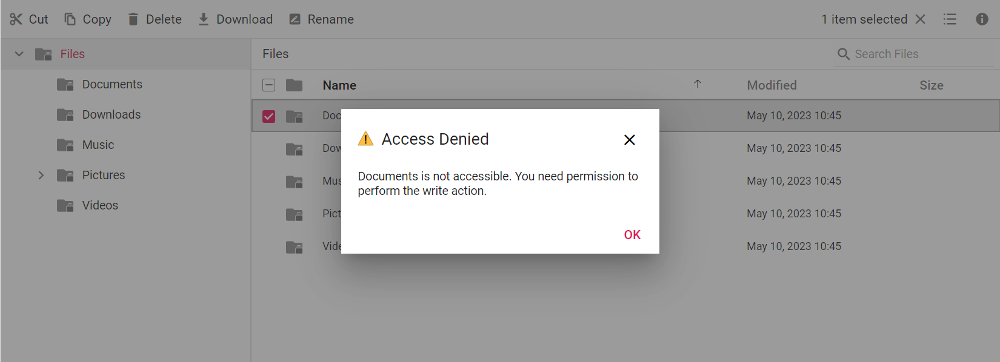

# Access Control in Blazor File Manager

Access control in the [Blazor File Manager](https://www.syncfusion.com/blazor-components/blazor-file-manager) allows you to restrict user actions by defining permissions for files and folders. This security feature lets you control who can read, write, download, upload, or copy specific content based on user roles.

In the Blazor File Manager, access rules are configured in the server-side file system provider. The provider evaluates the rules for each request and returns the permissions of each file and folder to the File Manager.

* [Prerequisites](#prerequisites)
* [Access Rules](#access-rules)
* [Permissions](#permissions)
* [Configure access rules in the file system provider](#configure-access-rules-in-the-file-system-provider)
* [Access control example](#access-control-example)

## Prerequisites

Before configuring access control, make sure that the following are available:

* A Blazor application with the Blazor File Manager component configured. For package installation, service registration, and theme references, refer to the [Getting Started](./getting-started-with-web-app) page.
* An ASP.NET Core file system provider service that performs the File Manager operations. This topic uses the [physical file system provider](https://github.com/SyncfusionExamples/ej2-aspcore-file-provider). For other providers, refer to the [File system providers](./file-system-provider.md) page.
* A .NET 8.0 or later SDK to build and run the physical file system provider.

## Access Rules

Access rules define the security permissions for folders and files in the File Manager. The file system provider's `SetRules()` method provides the foundation for implementing these rules in your application.

To set up access rules for folders (including their files and sub-folders) and individual files, pass an `AccessDetails` object containing a list of `AccessRule` entries to the `SetRules()` method of the file system provider. The rules determine which operations are allowed for specific paths and user roles.

The following table represents the `AccessRule` properties available for files and folders:

| **Property** | **Applicable to file** | **Applicable to folder** | **Description** |
| --- | --- | --- | --- |
| Copy | Yes | Yes | Allows copying a file or folder. |
| Read | Yes | Yes | Allows reading a file or folder. |
| Write | Yes | Yes | Allows writing to a file or folder. |
| WriteContents | No | Yes | Allows writing the contents of a folder. |
| Download | Yes | Yes | Allows downloading a file or folder. |
| Upload | No | Yes | Allows uploading to the folder. |
| Path | Yes | Yes | Specifies the path to which the rules apply. |
| Role | Yes | Yes | Specifies the role to which the rule applies. |
| IsFile | Yes | Yes | Specifies whether the rule targets a folder or a file. |

The following example represents the access rules for an `Administrator` role:

```csharp
// Administrator
// Access Rules for File
new AccessRule { Path = "/*.*", Role = "Administrator", Read = Permission.Allow, Write = Permission.Allow,
Copy = Permission.Allow, Download = Permission.Allow, IsFile = true },

// Access Rules for folder
new AccessRule { Path = "*", Role = "Administrator", Read = Permission.Allow, Write = Permission.Allow,
Copy = Permission.Allow, WriteContents = Permission.Allow, Upload = Permission.Allow, Download = Permission.Deny,
IsFile = false },
```

The following example represents the access rules for a `Default User` role with all file operations denied:

```csharp
// Default User
// Access Rules for File
new AccessRule { Path = "/*.*", Role = "Default User", Read = Permission.Deny, Write = Permission.Deny,
Copy = Permission.Deny, Download = Permission.Deny, IsFile = true },

// Access Rules for folder
new AccessRule { Path = "*", Role = "Default User", Read = Permission.Deny, Write = Permission.Deny,
Copy = Permission.Deny, WriteContents = Permission.Deny, Upload = Permission.Deny, Download = Permission.Deny,
IsFile = false },
```

## Permissions

This section explains how to apply security permissions to File Manager files or folders using access rules. The File Manager uses two permission values:

| **Value** | **Description** |
| --- | --- |
| `Permission.Allow` | Allows the role to perform the read, write, copy, and download operations defined by the rule. |
| `Permission.Deny` | Denies the role from performing the read, write, copy, and download operations defined by the rule. |

Use the `Role` property to apply created roles to the File Manager. After assigning roles, the File Manager displays folders or files and allows operations based on the permissions defined for each role.

### Examples of permission rules

#### Denying write permission for the administrator

```csharp
// For file
new AccessRule { Path = "/*.*", Role = "Administrator", Read = Permission.Allow, Write = Permission.Deny, IsFile = true },

// For folder
new AccessRule { Path = "*", Role = "Administrator", Read = Permission.Allow, Write = Permission.Deny, IsFile = false },
```

#### Denying write permission for specific folders or files

```csharp
// Deny writing for a particular folder
new AccessRule { Path = "/Documents", Role = "Document Manager", Read = Permission.Allow, Write = Permission.Deny,
Copy = Permission.Allow, WriteContents = Permission.Deny, Upload = Permission.Deny, Download = Permission.Deny,
IsFile = false },

// Deny writing for a particular file
new AccessRule { Path = "/Pictures/Employees/Adam.png", Role = "Document Manager", Read = Permission.Allow,
Write = Permission.Deny, Copy = Permission.Deny, Download = Permission.Deny, IsFile = true },
```

#### Denying write and upload permissions for the root folder

```csharp
// Folder rule
new AccessRule { Path = "/", Role = "Document Manager", Read = Permission.Allow, Write = Permission.Deny,
Copy = Permission.Deny, WriteContents = Permission.Deny, Upload = Permission.Deny, Download = Permission.Deny,
IsFile = false },
```

## Configure access rules in the file system provider

### Step 1: Clone the file system provider

Clone the physical file system provider and open it in Visual Studio or Visual Studio Code.

```bash
git clone https://github.com/SyncfusionExamples/ej2-aspcore-file-provider ej2-aspcore-file-provider
cd ej2-aspcore-file-provider
```

The provider contains a `FileManagerAccessController` (**Controllers/FileManagerAccessController.cs**) that exposes the `FileOperations`, `Upload`, `Download`, and `GetImage` endpoints used for access control.

### Step 2: Define the access rules

Define the access rules in the `GetRules()` method of `FileManagerAccessController`. The method returns an `AccessDetails` object that holds the list of `AccessRule` entries and the role applied to the requests.

```csharp
public AccessDetails GetRules()
{
    AccessDetails accessDetails = new AccessDetails();
    List<AccessRule> Rules = new List<AccessRule> {
        // Deny writing for particular folder
        new AccessRule { Path = "/Documents", Role = "Document Manager", Read = Permission.Allow, Write = Permission.Deny, Copy = Permission.Allow, WriteContents = Permission.Deny, Upload = Permission.Deny, Download = Permission.Deny, IsFile = false },
        // Deny writing for particular file
        new AccessRule { Path = "/Pictures/Employees/Adam.png", Role = "Document Manager", Read = Permission.Allow, Write = Permission.Deny, Copy = Permission.Deny, Download = Permission.Deny, IsFile = true },
        // Allow uploading only files to a particular folder
        new AccessRule { Path = "/Music", Role = "Document Manager", Read = Permission.Allow, Write = Permission.Deny, Copy = Permission.Allow, WriteContents = Permission.Deny, Upload = Permission.Allow, Download = Permission.Deny, UploadContentFilter = UploadContentFilter.FilesOnly, IsFile = false },
    };
    accessDetails.AccessRules = Rules;
    accessDetails.Role = "Document Manager";
    return accessDetails;
}
```

N> The `Role` value in `AccessDetails` identifies the role applied to incoming requests. In a production application, resolve this value from the authenticated user's claims or role manager instead of hard-coding it.

### Step 3: Apply the access rules

The `FileOperations` action passes the rules to the provider's `SetRules()` method before performing the requested file operation:

```csharp
[Route("FileOperations")]
public object FileOperations([FromBody] FileManagerDirectoryContent args)
{
    this.operation.SetRules(GetRules());
    // ...
}
```

### Step 4: Run the file system provider

Run the provider project and note the base URL shown in the console or browser. This URL is used in the File Manager's `FileManagerAjaxSettings`.

## Access control example

Set the [FileManagerAjaxSettings](https://help.syncfusion.com/cr/blazor/Syncfusion.Blazor.FileManager.FileManagerAjaxSettings.html) of the Blazor File Manager to the `FileManagerAccess` endpoints of the file system provider.

N> If the interactivity location is set to `Per page/component` in the Blazor Web App, define a render mode at the top of the Razor file (for example, `InteractiveServer`, `InteractiveWebAssembly`, or `InteractiveAuto`).




@using Syncfusion.Blazor.FileManager

<SfFileManager TValue="FileManagerDirectoryContent">
    <FileManagerAjaxSettings Url="https://physical-service.syncfusion.com/api/FileManagerAccess/FileOperations"
                             UploadUrl="https://physical-service.syncfusion.com/api/FileManagerAccess/Upload"
                             DownloadUrl="https://physical-service.syncfusion.com/api/FileManagerAccess/Download"
                             GetImageUrl="https://physical-service.syncfusion.com/api/FileManagerAccess/GetImage">
    </FileManagerAjaxSettings>
</SfFileManager>




N> The URLs above point to Syncfusion's hosted physical file system provider, which applies the access rules shown in Step 2. To use your own rules, replace the base URL with the URL of your provider from Step 4 (for example, `http://localhost:{port}/api/FileManagerAccess/FileOperations`).

With these rules, the `Document Manager` role cannot write to, upload to, or download from the **Documents** folder. It cannot rename, delete, copy, or download the **Pictures/Employees/Adam.png** file, and it can upload only files to the **Music** folder.



## See also

* [File system providers](./file-system-provider.md)
* [Getting Started with Blazor File Manager in Blazor Web App](./getting-started-with-web-app)
* [Restrict drag and drop upload](./how-to/restrict-drag-and-drop-upload.md)
