# End User Capabilities in Blazor File Manager

The [Blazor File Manager](https://www.syncfusion.com/blazor-components/blazor-file-manager) UI is comprised of several sections like View, Toolbar, Breadcrumb, Context Menu, and so on. The UI of the Blazor File Manager is enhanced with  `Details View` for browsing files and folders in a grid, `Navigation Pane` for folder navigation, and `Toolbar` for file operations. The Blazor File Manager with all features has the following sections in its UI.

* [Toolbar](#toolbar) (For direct access to file operations)
* [Context Menu](#context-menu) (For accessing file operations)
* [Navigation Pane](#navigation-pane) (For easy navigation between folders)
* [Breadcrumb](#breadcrumb) (For parent folder navigations)
* [Large icons view](#large-icons-view) (For browsing files and folders using large icon view)
* [Details view](#details-view) (For browsing files and folders using  details view)

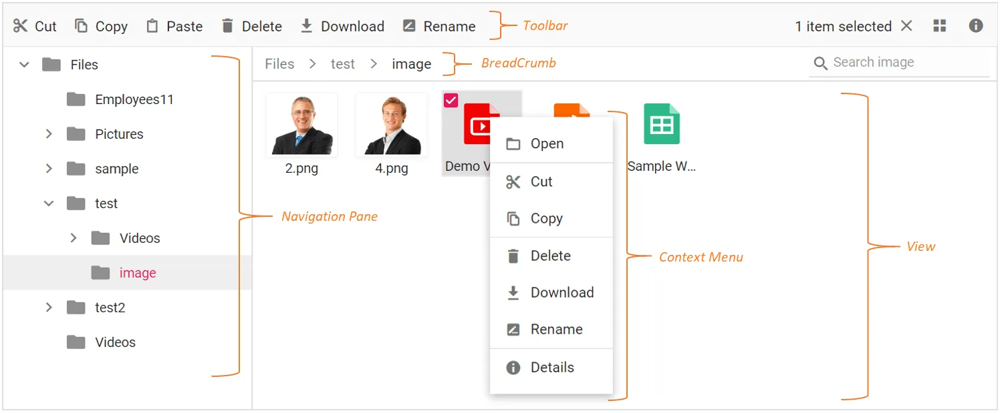

The basic Blazor File Manager is a lightweight component with all the basic functions. The basic Blazor File Manager has the following sections in its UI to browse files and folders and manage them with file operations.

* [Breadcrumb](#breadcrumb) (For parent folder navigations)
* [Large icons view](#large-icons-view) (For browsing files and folders)
* [Context Menu](#context-menu) (For accessing file operations)

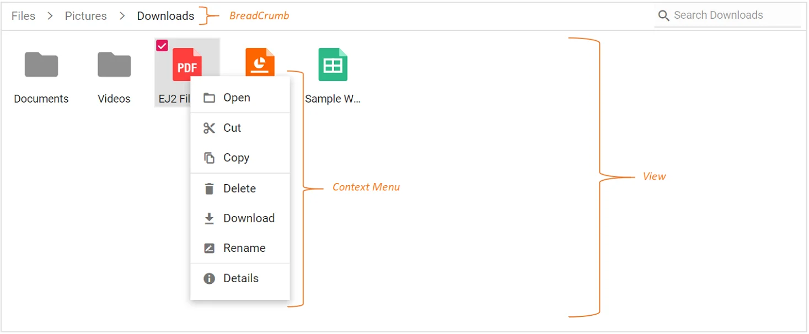

## Toolbar

The `Toolbar` provides easy access to file operations through buttons and is presented at the top of the Blazor File Manager.

If the Toolbar items exceed the size of the Toolbar, then the exceeding Toolbar size will be moved to Toolbar popup with a dropdown button at the end of Toolbar.

Refer to the [Toolbar](./file-operations.md#toolbar) section in File operations to know more about the buttons present in the Toolbar.

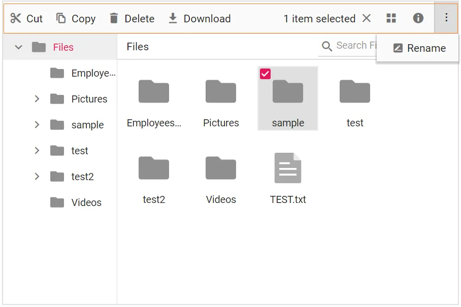

## Context Menu

The Context Menu appears on user interaction such as right-click. The Blazor File Manager supports a Context Menu to perform a list of file operations on files and folders. Context menu items vary based on the target, such as a file, a folder (including navigation-pane folders), or the layout (empty area in the view).

Context menu can be customized using the [ContextMenuSettings](https://help.syncfusion.com/cr/blazor/Syncfusion.Blazor.FileManager.FileManagerContextMenuSettings.html), [MenuOpened](https://help.syncfusion.com/cr/blazor/Syncfusion.Blazor.FileManager.FileManagerEvents-1.html#Syncfusion_Blazor_FileManager_FileManagerEvents_1_MenuOpened), and [OnMenuClick](https://help.syncfusion.com/cr/blazor/Syncfusion.Blazor.FileManager.FileManagerEvents-1.html#Syncfusion_Blazor_FileManager_FileManagerEvents_1_OnMenuClick) events.

Refer [Context Menu](https://blazor.syncfusion.com/documentation/file-manager/context-menu) section to know more about the menu items present in Context Menu.

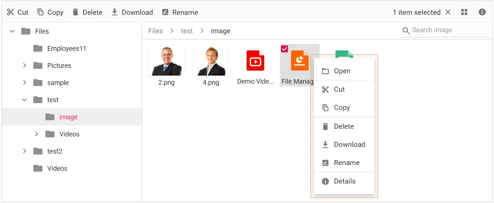

## Files and Folders Navigation

The Blazor File Manager provides navigation between files and folders using the following two options.

* [Navigation Pane](#navigation-pane)
* [Breadcrumb](#breadcrumb)

### Navigation Pane

The navigation pane displays the folder hierarchy of the file system and provides easy navigation to the desired folder. Using [NavigationPaneSettings](https://help.syncfusion.com/cr/blazor/Syncfusion.Blazor.FileManager.FileManagerNavigationPaneSettings.html), minimum and maximum width of the navigation pane can be changed. The navigation pane can be shown or hidden using the [Visible](https://help.syncfusion.com/cr/blazor/Syncfusion.Blazor.FileManager.FileManagerNavigationPaneSettings.html#Syncfusion_Blazor_FileManager_FileManagerNavigationPaneSettings_Visible) option in the [NavigationPaneSettings](https://help.syncfusion.com/cr/blazor/Syncfusion.Blazor.FileManager.FileManagerNavigationPaneSettings.html).

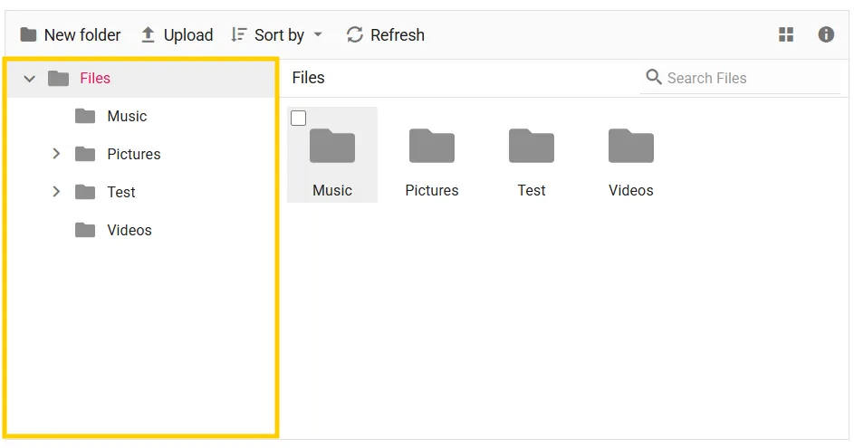

You can customize the appearance of the navigation pane by using the `NavigationPaneTemplate` property. This enables you to modify icons, display text, and include additional elements to suit your application's requirements.

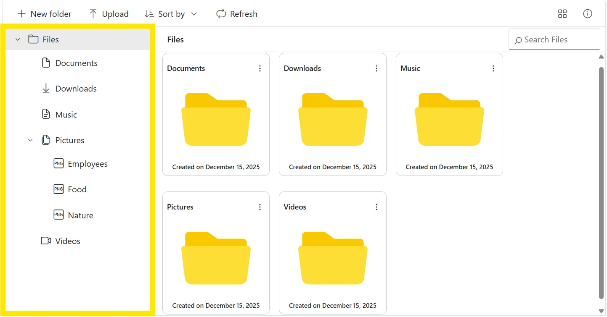

### Breadcrumb

The Blazor File Manager provides breadcrumb for navigating to the parent folders. The breadcrumb in the Blazor File Manager is responsible for resizing. When the current path is longer than the breadcrumb can display, a dropdown button is added at the start of the breadcrumb to hold the parent folders adjacent to the root.

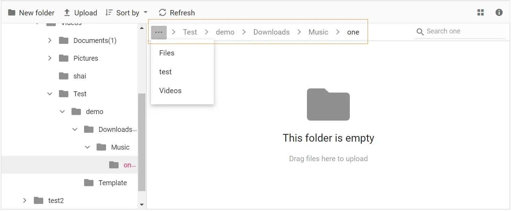

## Large Icons View

The `Large Icons View` is the default starting view in the Blazor FileManager. The view can be changed by using the [Toolbar](#toolbar) view button or by using the view menu in [Context Menu](#context-menu). The [View](https://help.syncfusion.com/cr/blazor/Syncfusion.Blazor.FileManager.SfFileManager-1.html#Syncfusion_Blazor_FileManager_SfFileManager_1_View) API can also be used to change the initial view of the Blazor FileManager.

In the large icons view, the thumbnail icons will be shown in a larger size, which displays the data in a form that best suits their content. For image and video type files, a **preview** will be displayed. Extension thumbnails will be displayed for other type files.

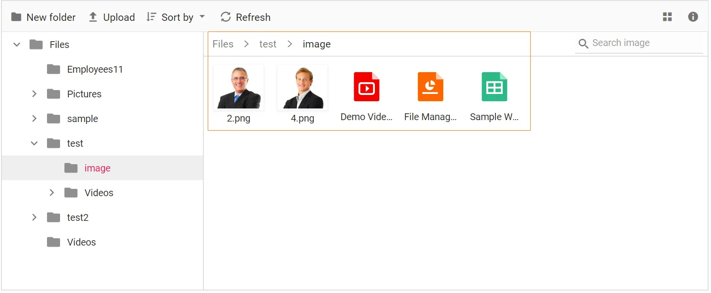

The `LargeIconsTemplate` property enables complete customization of how folders and files are rendered in the `Large Icons View`. It allows you to enhance the layout by adding background images, custom file-type icons, and actions such as dropdown menus.

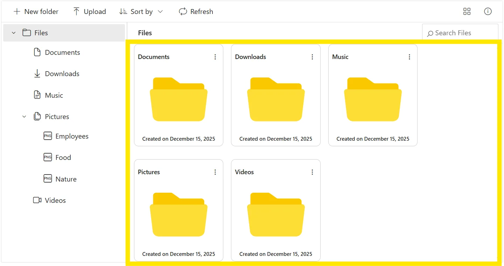

## Details View

In the details view, the files are displayed in a sorted list order. This file list comprises several columns of information about the files, such as **Name**, **Date Modified**, **Type**, and **Size**. Each file is shown with a small icon that indicates its type. Additional columns can be added using the [DetailsViewSettings](https://help.syncfusion.com/cr/blazor/Syncfusion.Blazor.FileManager.FileManagerDetailsViewSettings.html) API. The details view allows you to sort by clicking a column header.

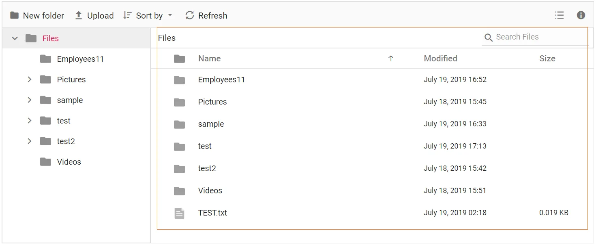

## File Operations

The Blazor File Manager component browses, manages, and organizes files and folders in a file system through a web application. It supports all essential file operations, including creating new folders, uploading and downloading files, deleting and renaming existing files and folders, and previewing image files.

Moreover, the table below displays the basic operations in the Blazor File Manager component and their corresponding functions.

|Operation Name|Function|
|----|----|
|read|Read the details of files or folders available in the given path from the file system to display the files for browsing.|
|create|Creates a new folder in the current path of the file system.|
|delete|Removes the file or folder from the file server.|
|rename|Rename the selected file or folder in the file system.|
|search|Searches for items matching the search string in the current and child directories.|
|details|Gets the detail of the selected item(s) from the file server.|
|copy|Copy the selected file or folder in the file system.|
|move|Cut the selected file or folder in the file server.|
|upload|Upload files to the current path or directory in the file system.|
|download|Downloads the file from the server and the multiple files can be downloaded as ZIP files.|

N> The *CreateFolder*, *Remove*, and *Rename* actions will be reflected in the Blazor File Manager only after the successful response from the server.

### File and Folder Selection 

In the Blazor File Manager component, you can select files and folders using a mouse click and the arrow keys. The Blazor File Manager allows you to select multiple files and folders by enabling the [AllowMultiSelection](https://help.syncfusion.com/cr/blazor/Syncfusion.Blazor.FileManager.SfFileManager-1.html#Syncfusion_Blazor_FileManager_SfFileManager_1_AllowMultiSelection) property, which is enabled by default.

You can perform multiple selections by pressing the Ctrl key or Shift key and selecting the files and folders, or by using the checkbox. To select all files in the current directory, you can use the Ctrl + A shortcut. 

The [FileSelected](https://help.syncfusion.com/cr/blazor/Syncfusion.Blazor.FileManager.FileManagerEvents-1.html#Syncfusion_Blazor_FileManager_FileManagerEvents_1_FileSelected) event will be triggered when an item in the Blazor File Manager control is selected or unselected.

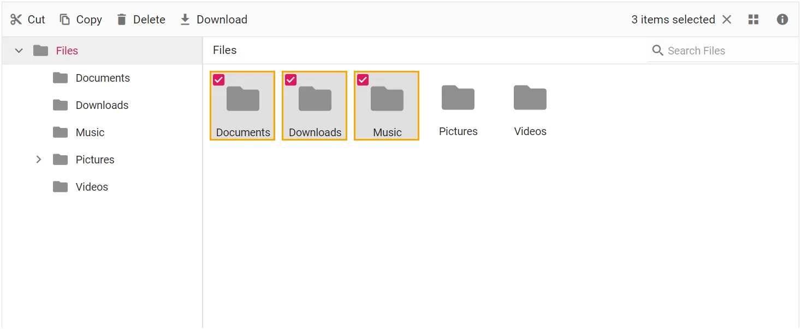

### Create, Rename, Delete a File or Folder

In the Blazor File Manager component, you can perform the [**create**](https://blazor.syncfusion.com/documentation/file-manager/file-operations#creating-files-and-folders), [**rename**](https://blazor.syncfusion.com/documentation/file-manager/file-operations#renaming-files-and-folders), and [**delete**](https://blazor.syncfusion.com/documentation/file-manager/file-operations#deleting-files-and-folders) operations on files and folders using the Toolbar buttons or Context Menu items.

Refer to the [Toolbar](./file-operations.md#toolbar) and [Context Menu](./context-menu.md#context-menu-in-blazor-filemanager-component) sections to learn more about the items present in the Toolbar and Context Menu.

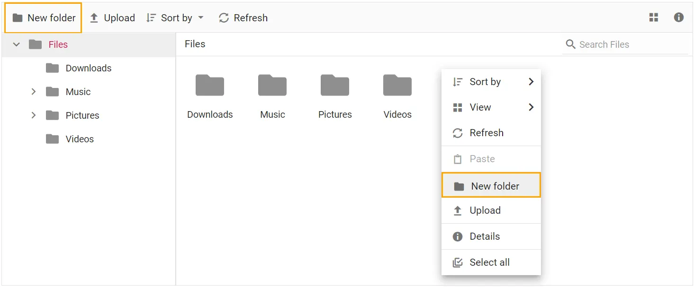

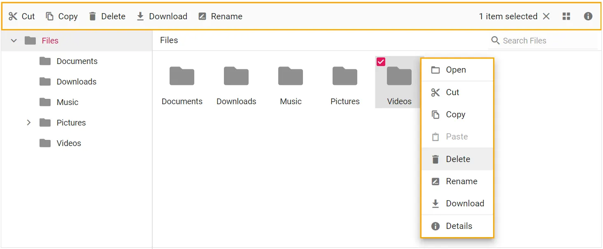

### Moving File or Folder

In the Blazor File Manager component, you can [**move**](https://blazor.syncfusion.com/documentation/file-manager/file-operations#moving-files-and-folders) files or folders using the **Cut** or **Copy** buttons in the Toolbar, or by using the Context Menu. Additionally, you can move files or folders by utilizing the drag and drop functionality, which requires enabling the [AllowDragAndDrop](https://help.syncfusion.com/cr/blazor/Syncfusion.Blazor.FileManager.SfFileManager-1.html#Syncfusion_Blazor_FileManager_SfFileManager_1_AllowDragAndDrop) property to **true**.

To learn more, you can refer to the [Toolbar](https://blazor.syncfusion.com/documentation/file-manager/toolbar), [Context Menu](https://blazor.syncfusion.com/documentation/file-manager/context-menu), and [Drag and Drop](https://blazor.syncfusion.com/documentation/file-manager/drag-and-drop) sections.

### Upload or Download a File

In the Blazor File Manager component, you can perform the [upload](https://blazor.syncfusion.com/documentation/file-manager/file-operations#uploading-files) or [download](https://blazor.syncfusion.com/documentation/file-manager/file-operations#downloading-files) operations using the Toolbar buttons or Context Menu items.

Refer to the [Toolbar](https://blazor.syncfusion.com/documentation/file-manager/file-operations#toolbar) and [Context Menu](https://blazor.syncfusion.com/documentation/file-manager/context-menu) sections to learn more about the items present in the Toolbar and Context Menu.

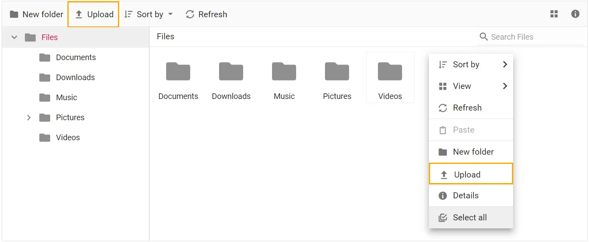

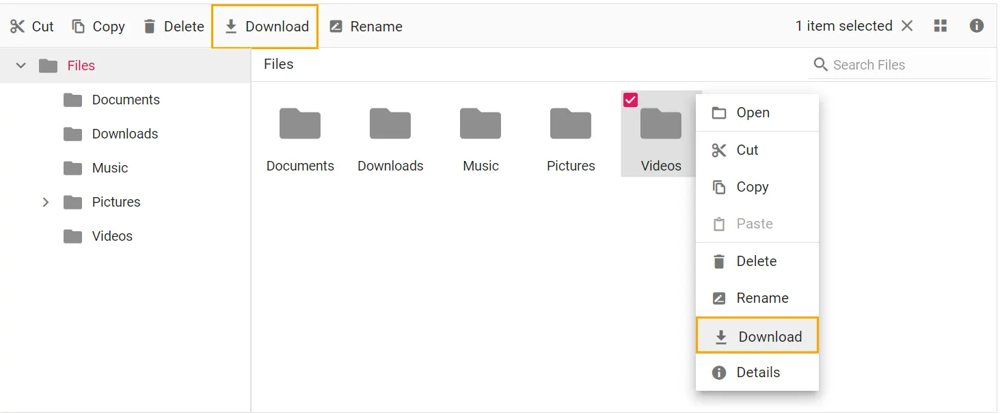

### Upload Files or Folders via context menu

In the Blazor File Manager component, you can upload files or folders using Context Menu items by switching between Files or Folder in the Upload menu item.

Refer to the [Context Menu](https://blazor.syncfusion.com/documentation/file-manager/context-menu) section to learn more about the items present in the Context Menu.

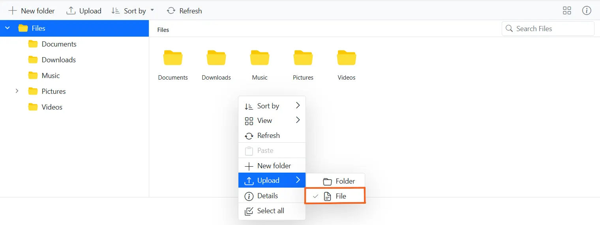

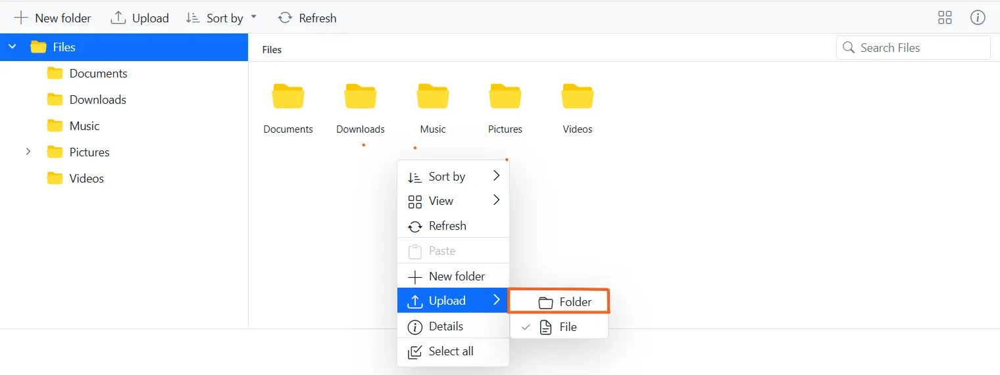

### Searching Files and Folders

In the Blazor File Manager component, you can [search](https://blazor.syncfusion.com/documentation/file-manager/file-operations#searching-files-and-folders) for specific files and folders using the default input search functionality.

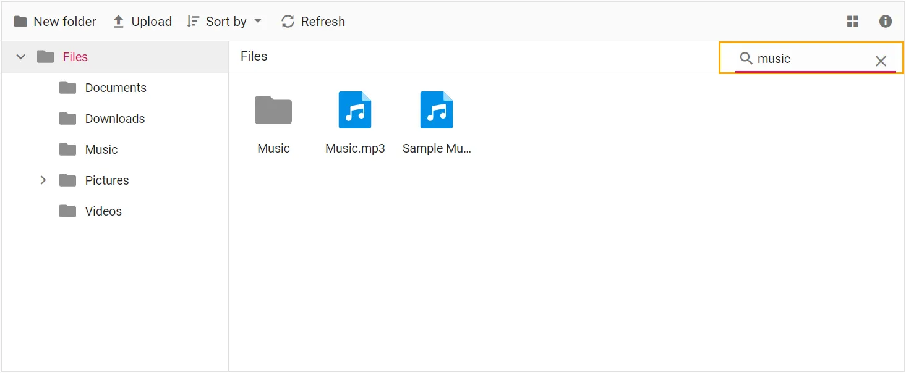

### Cut, Copy, and Paste

You can perform the **cut**, **copy**(https://blazor.syncfusion.com/documentation/file-manager/file-operations#copying-files-and-folders), and **paste** operations on files and folders in the Blazor File Manager component using the Toolbar buttons or Context Menu items.

Refer to the [Toolbar](https://blazor.syncfusion.com/documentation/file-manager/file-operations#toolbar) and [Context Menu](https://blazor.syncfusion.com/documentation/file-manager/context-menu) sections to learn more about the items present in the Toolbar and Context Menu.

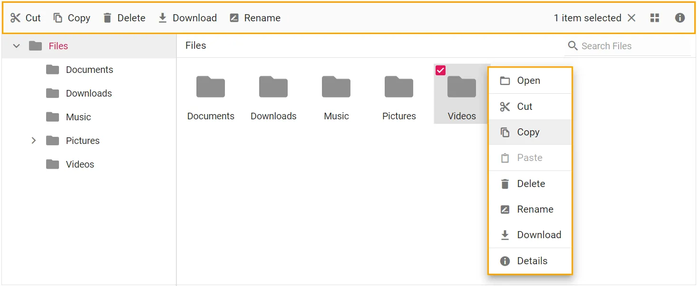