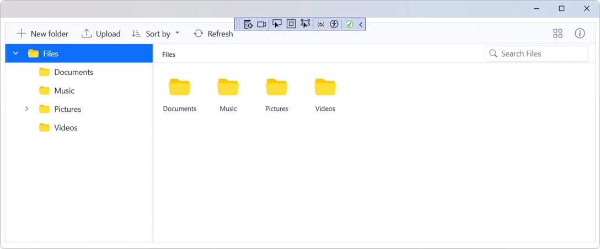
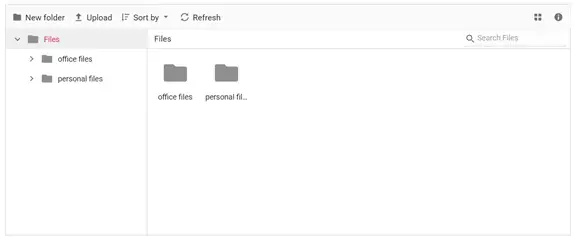

# Getting Started with Blazor FileManager in Blazor MAUI App

This section walks you through the step-by-step process of integrating the [Blazor FileManager](https://www.syncfusion.com/blazor-components/blazor-file-manager) component into your Blazor MAUI App using [Visual Studio](https://visualstudio.microsoft.com/vs/) and [Visual Studio Code](https://code.visualstudio.com/).

> The Blazor FileManager is currently supported on **Windows** and **Android** targets only. iOS and Mac Catalyst are not supported at this time.





## Prerequisites

- Install [Visual Studio 2022](https://visualstudio.microsoft.com/vs/) (latest preview) with the **Mobile development with .NET** workload. For more details, refer to [here](https://learn.microsoft.com/en-us/dotnet/MAUI/get-started/installation?tabs=vswin).
- (Optional) Install the [Syncfusion® Blazor Extension](https://blazor.syncfusion.com/documentation/visual-studio-integration/template-studio) to scaffold Blazor MAUI projects from a template.
- Install the .NET MAUI workload by running the following command in a terminal:

    ```bash
    dotnet workload install maui
    ```

## Create a new Blazor MAUI App in Visual Studio

Create a Blazor MAUI App using Visual Studio via [Microsoft Templates](https://learn.microsoft.com/en-us/dotnet/maui/get-started/first-app?pivots=devices-windows&view=net-maui-9.0&tabs=vswin). For detailed instructions, refer to the [Blazor MAUI App Getting Started](https://blazor.syncfusion.com/documentation/getting-started/maui-blazor-app) documentation.

Alternatively, create a Blazor MAUI App from the integrated terminal using the following command:

```bash
dotnet new maui-blazor -o MauiBlazorApp
cd MauiBlazorApp
```





## Prerequisites

- Install the latest [.NET SDK](https://dotnet.microsoft.com/download).
- Install the [C# Dev Kit](https://marketplace.visualstudio.com/items?itemName=ms-dotnettools.csdevkit) extension for VS Code.
- Install the MAUI workload by running the following command in a terminal:

    ```bash
    dotnet workload install maui
    ```

- (Optional) Install the [Syncfusion® Blazor Extension](https://blazor.syncfusion.com/documentation/visual-studio-code-integration/create-project) to scaffold Blazor MAUI projects from a template.

For more details, refer to [here](https://learn.microsoft.com/en-us/dotnet/maui/get-started/installation?view=net-maui-9.0&tabs=visual-studio-code).

## Create a new Blazor MAUI App in Visual Studio Code

Create a Blazor MAUI App using Visual Studio Code via [Microsoft Templates](https://learn.microsoft.com/en-us/dotnet/maui/get-started/first-app?pivots=devices-windows&view=net-maui-9.0&tabs=visual-studio-code) or the [Syncfusion® Blazor Extension](https://blazor.syncfusion.com/documentation/visual-studio-code-integration/create-project). For detailed instructions, refer to the [Blazor MAUI App Getting Started](https://blazor.syncfusion.com/documentation/getting-started/maui-blazor-app) documentation.

Alternatively, create a Blazor MAUI App by running the following command in the integrated terminal (<kbd>Ctrl</kbd>+<kbd>`</kbd>):

```bash
dotnet new maui-blazor -o MauiBlazorApp
cd MauiBlazorApp
```





## Register Syncfusion license key

Syncfusion Blazor components require a license key. Register it in **~/MauiProgram.cs** before calling `AddSyncfusionBlazor()`:

```csharp
Syncfusion.Licensing.SyncfusionLicenseProvider.RegisterLicense("YOUR_LICENSE_KEY");
```

See [Registering Syncfusion license key](https://blazor.syncfusion.com/documentation/getting-started/license-key) for more details.

## Install required Blazor packages

Install [Syncfusion.Blazor.FileManager](https://www.nuget.org/packages/Syncfusion.Blazor.FileManager) and [Syncfusion.Blazor.Themes](https://www.nuget.org/packages/Syncfusion.Blazor.Themes/) NuGet packages in your project using the NuGet Package Manager in Visual Studio (*Tools → NuGet Package Manager → Manage NuGet Packages for Solution*), or the integrated terminal in Visual Studio Code (`dotnet add package`).

Alternatively, run the following commands in the Package Manager Console:




Install-Package Syncfusion.Blazor.FileManager -Version {{ site.releaseversion }}
Install-Package Syncfusion.Blazor.Themes -Version {{ site.releaseversion }}




Or using the .NET CLI:

```bash
dotnet add package Syncfusion.Blazor.FileManager -Version {{ site.releaseversion }}
dotnet add package Syncfusion.Blazor.Themes -Version {{ site.releaseversion }}
```

N> All Syncfusion Blazor packages are available on [nuget.org](https://www.nuget.org/packages?q=syncfusion.blazor). See the [NuGet packages](https://blazor.syncfusion.com/documentation/nuget-packages) topic for details. Refer to the [Release Notes](https://blazor.syncfusion.com/documentation/release-notes) for the latest available version.

## Add import namespaces

After the packages are installed, open the **~/_Imports.razor** file and import the `Syncfusion.Blazor` and `Syncfusion.Blazor.FileManager` namespaces.




@using Syncfusion.Blazor 
@using Syncfusion.Blazor.FileManager




## Register Blazor service

Register the Blazor FileManager service in the **~/MauiProgram.cs** file. The complete file should look similar to the following:




using Microsoft.Extensions.Logging;
using Syncfusion.Blazor;

namespace MauiBlazorApp;

public static class MauiProgram
{
    public static MauiApp CreateMauiApp()
    {
        var builder = MauiApp.CreateBuilder();
        builder
            .UseMauiApp<App>()
            .ConfigureFonts(fonts =>
            {
                fonts.AddFont("OpenSans-Regular.ttf", "OpenSansRegular");
            });

        builder.Services.AddMauiBlazorWebView();
        builder.Services.AddSyncfusionBlazor();
#if DEBUG
        builder.Services.AddBlazorWebViewDeveloperTools();
        builder.Logging.AddDebug();
#endif

        return builder.Build();
    }
}




N> `AddSyncfusionBlazor()` accepts an optional configuration delegate (for example, `AddSyncfusionBlazor(options => { ... })`) for advanced scenarios. Refer to the [API reference](https://help.syncfusion.com/cr/blazor/Syncfusion.Blazor.SyncfusionBlazorBuilderExtensions.html) for the available options.

## Add stylesheet and script resources

The theme stylesheet and script can be accessed from NuGet through [Static Web Assets](https://blazor.syncfusion.com/documentation/appearance/themes#static-web-assets). Include the stylesheet and script references in the **~/wwwroot/index.html** file. If you are using the default MAUI Blazor template, this file is located under `wwwroot/` of the Blazor MAUI project.

```html

<link href="_content/Syncfusion.Blazor.Themes/fluent2.css" rel="stylesheet" />
<script src="_content/Syncfusion.Blazor.Core/scripts/syncfusion-blazor.min.js" type="text/javascript"></script>

```

N> If your template ships with default Bootstrap or other theme links, remove or replace them to avoid style conflicts. Check out the [Blazor Themes](https://blazor.syncfusion.com/documentation/appearance/themes) topic to discover various methods ([Static Web Assets](https://blazor.syncfusion.com/documentation/appearance/themes#static-web-assets), [CDN](https://blazor.syncfusion.com/documentation/appearance/themes#cdn-reference), and [CRG](https://blazor.syncfusion.com/documentation/common/custom-resource-generator)) for referencing themes in your Blazor application. Also, check out the [Adding Script Reference](https://blazor.syncfusion.com/documentation/common/adding-script-references) topic to learn different approaches for adding script references in your Blazor application.

## Add Blazor FileManager component

Add the Blazor FileManager component in the **~/Pages/Home.razor** file.




@using Syncfusion.Blazor.FileManager

<SfFileManager TValue="FileManagerDirectoryContent">
    <FileManagerAjaxSettings Url="https://physical-service.syncfusion.com/api/FileManager/FileOperations"
                             UploadUrl="https://physical-service.syncfusion.com/api/FileManager/Upload"
                             DownloadUrl="https://physical-service.syncfusion.com/api/FileManager/Download"
                             GetImageUrl="https://physical-service.syncfusion.com/api/FileManager/GetImage">
    </FileManagerAjaxSettings>
</SfFileManager>




**Property reference:**

| Property | Type | Description |
| --- | --- | --- |
| `TValue` | `Type` | The data type of the file/folder records returned by the service. Use `FileManagerDirectoryContent` for the default service. |
| `FileManagerAjaxSettings.Url` | `string` | Endpoint used for file operations (read, create, rename, delete, etc.). |
| `FileManagerAjaxSettings.UploadUrl` | `string` | Endpoint that handles file uploads. |
| `FileManagerAjaxSettings.DownloadUrl` | `string` | Endpoint that serves files for download. |
| `FileManagerAjaxSettings.GetImageUrl` | `string` | Endpoint that returns image thumbnails. |

N> The endpoints shown above point to Syncfusion's **public sample service** at `https://physical-service.syncfusion.com`. They are read-only and intended for demos. For production use, replace them with your own service implementing the Syncfusion FileManager protocol. See [File System Provider](file-system-provider.md) and [Custom File Provider](custom-file-provider.md) for details.

## Android permissions

When targeting Android, your app may need permissions to read from and write to local storage. For most modern targets, the MAUI app uses scoped storage by default and no extra permissions are required for app-private directories. If your `FileManagerAjaxSettings` endpoints proxy to a service that accesses public storage, configure the appropriate permissions in **~/Platforms/Android/AndroidManifest.xml**:

```xml
<uses-permission android:name="android.permission.READ_EXTERNAL_STORAGE" />
<uses-permission android:name="android.permission.WRITE_EXTERNAL_STORAGE" />
```

For Android 13+ use [granular media permissions](https://learn.microsoft.com/en-us/dotnet/maui/android/permissions) (`READ_MEDIA_IMAGES`, `READ_MEDIA_VIDEO`, `READ_MEDIA_AUDIO`).

## How to run the sample

### How to run the sample on Windows

Set the debug target to **Windows Machine** in the Visual Studio or VS Code run menu, then press F5 to run the sample.



### How to run the sample on Android

1. Install and launch an Android emulator as described [here](https://learn.microsoft.com/en-us/dotnet/maui/android/emulator/device-manager#android-device-manager-on-windows).
2. In Visual Studio, set the debug target to an **Android Emulator** (e.g., `Pixel 5 - API 34`); in VS Code, run the **MAUI - Android** launch configuration.
3. Press F5 to build and deploy. The first build will take several minutes.



N> If you encounter any errors while using the Android Emulator, refer to [Troubleshooting Android Emulator](https://learn.microsoft.com/en-us/dotnet/maui/android/emulator/troubleshooting) for guidance.

## Troubleshooting

| Issue | Likely cause | Fix |
| --- | --- | --- |
| `SfFileManager` renders but no files appear | The demo service is unreachable or blocked by network policy. | Replace the URLs with a local service (see [File System Provider](file-system-provider.md)). |
| Static asset 404 for `_content/Syncfusion.Blazor.Themes/...` | NuGet restore did not copy static web assets. | Run `dotnet restore` and rebuild. Confirm the package is referenced. |
| Android emulator build fails with workload errors | MAUI workload not installed. | Run `dotnet workload install maui`. |
| `AddSyncfusionBlazor` not found | `Syncfusion.Blazor` namespace not imported. | Add `@using Syncfusion.Blazor;` to **~/_Imports.razor** and `using Syncfusion.Blazor;` to **~/MauiProgram.cs**. |

## See also

- [File operations](file-operations.md)
- [File system provider](file-system-provider.md)
- [Custom file provider](custom-file-provider.md)
- [Upload](upload.md)
- [Multiple file selection](multiple-file-selection.md)
- [Getting started with Blazor Server App](getting-started-with-server-app.md)
- [Getting started with Blazor WebAssembly App](getting-started-with-wasm-app.md)
- [Getting started with Blazor Web App](getting-started-with-web-app.md)
