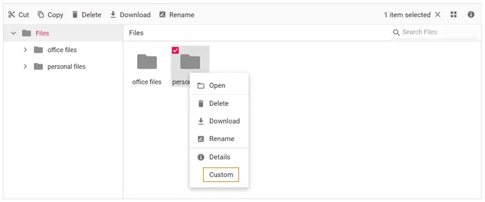

# How to Add a Custom Item to the Context Menu in Blazor File Manager

The context menu can be customized using the [`ContextMenuSettings`](https://help.syncfusion.com/cr/blazor/Syncfusion.Blazor.FileManager.FileManagerContextMenuSettings.html), [`MenuOpened`](https://help.syncfusion.com/cr/blazor/Syncfusion.Blazor.FileManager.FileManagerEvents-1.html#Syncfusion_Blazor_FileManager_FileManagerEvents_1_MenuOpened), and [`OnMenuClick`](https://help.syncfusion.com/cr/blazor/Syncfusion.Blazor.FileManager.FileManagerEvents-1.html#Syncfusion_Blazor_FileManager_FileManagerEvents_1_OnMenuClick) events.

> **Applies to:** Syncfusion Blazor FileManager (Server and WebAssembly hosts). Requires the `Syncfusion.Blazor` NuGet package, `AddSyncfusionBlazor()` registration in `Program.cs`, the File Operations sample controller, and the Syncfusion Blazor client-side resources (`_content/Syncfusion.Blazor.Core/styles.css` and the matching script) referenced in `_Host.cshtml`/`index.html`.

A custom item is added to the context menu in three steps:

1. Declare the item list with the custom label through `ContextMenuSettings`.
2. Add an icon to the custom item in the `MenuOpened` event.
3. Handle the click for the custom item in the `OnMenuClick` event.



## 1. Add the menu item through ContextMenuSettings

Pass the new item list to `ContextMenuSettings`. The string `"|"` renders as a menu separator, and the `"Custom"` text is the key referenced by the icon and click handlers in the next steps:

```razor

@using Syncfusion.Blazor.FileManager

    <SfFileManager TValue="FileManagerDirectoryContent">
        <FileManagerAjaxSettings Url="/api/SampleData/FileOperations"
                                 UploadUrl="/api/SampleData/Upload"
                                 DownloadUrl="/api/SampleData/Download"
                                 GetImageUrl="/api/SampleData/GetImage">
        </FileManagerAjaxSettings>
        <FileManagerEvents TValue="FileManagerDirectoryContent" OnMenuClick="OnMenuClick" MenuOpened="MenuOpened"></FileManagerEvents>
        <FileManagerContextMenuSettings  File="@Items" Folder="@Items"></FileManagerContextMenuSettings>
    </SfFileManager>

@code {
    public string[] Items = new string[] { "Open", "|", "Delete", "Download", "Rename", "|", "Details", "Custom" };
}

```

## Run the application

After successful compilation of your application, simply press `F5` to run the application.

