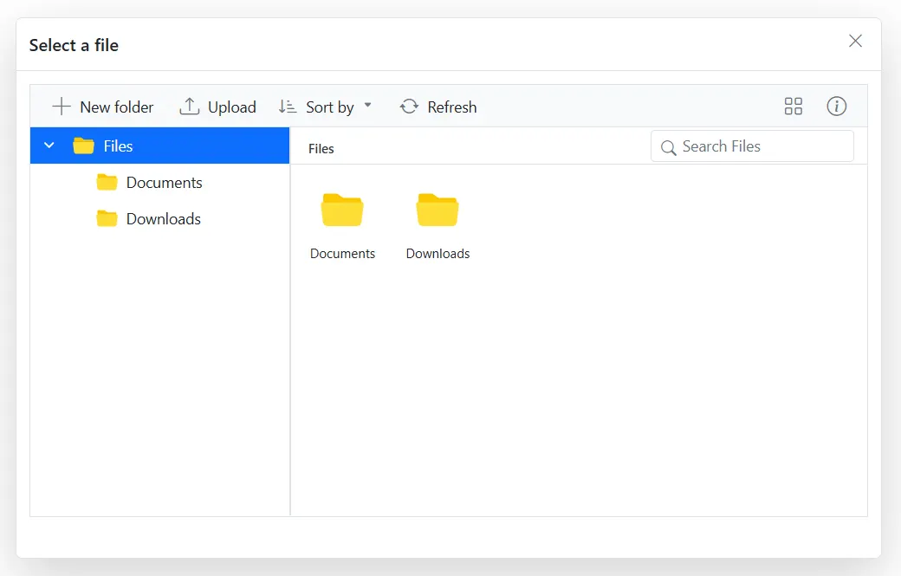
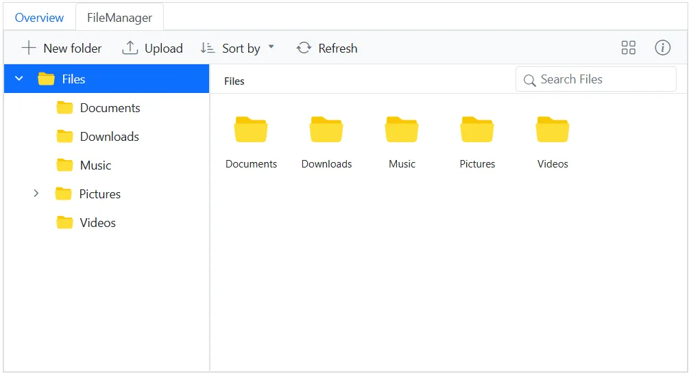

# How to Render the File Manager Inside Other Components in Blazor

## Prerequisites

Before you begin, ensure the following are in place:

* A Blazor application targeting .NET 6.0 or later.
* The following Syncfusion NuGet packages installed: `Syncfusion.Blazor`, `Syncfusion.Blazor.Popups` (for the Dialog sample), `Syncfusion.Blazor.Navigations` (for the Tab sample), and `Syncfusion.Blazor.Themes` (for the built-in stylesheets).
* Syncfusion Blazor services registered in `Program.cs` (for example, `builder.Services.AddSyncfusionBlazor();`).
* The Syncfusion theme stylesheet referenced in `App.razor` (Blazor Server) or `wwwroot/index.html` (Blazor WebAssembly).
* A valid Syncfusion license (community or commercial), registered at application startup via `Syncfusion.Licensing.SyncfusionLicenseProvider.RegisterLicense("YOUR_LICENSE_KEY");` in `Program.cs`.

The [Blazor File Manager](https://www.syncfusion.com/blazor-components/blazor-file-manager) component can be rendered within other components, such as the Dialog and Tab components. Use the **Dialog** option when the file picker is a one-off action the user must complete before continuing; use the **Tab** option when the File Manager is part of a multi-page view alongside other content.

> **Compatibility**: This guide applies to .NET 6.0 or later and Syncfusion Blazor packages 20.2.x and newer.

* [Adding the Blazor File Manager inside the Dialog](#adding-the-blazor-file-manager-inside-the-dialog)
* [Adding the Blazor File Manager inside a Tab](#adding-the-blazor-file-manager-inside-the-tab)

## Adding the Blazor File Manager inside the Dialog

When rendering the FileManager inside the `SfDialog` component, the layout may not initialize correctly because the dialog is hidden on first render. This sample uses the [flat data binding](https://blazor.syncfusion.com/documentation/file-manager/flat-data) pattern to supply the directory contents in memory.

### Why call RefreshLayoutAsync?

Because the File Manager computes its layout (grid columns, tree width, scroll dimensions) only when it is visible, the initial measurement taken while the dialog is hidden produces incorrect sizes. Call `RefreshLayoutAsync` in the dialog's `Opened` event so the File Manager recomputes those measurements after the dialog becomes visible.

To implement this, use the [RefreshLayoutAsync](https://help.syncfusion.com/cr/blazor/Syncfusion.Blazor.FileManager.SfFileManager-1.html#Syncfusion_Blazor_FileManager_SfFileManager_1_RefreshLayoutAsync) method of the FileManager component within the [Opened](https://help.syncfusion.com/cr/blazor/Syncfusion.Blazor.Popups.DialogEvents.html#Syncfusion_Blazor_Popups_DialogEvents_Opened) event of the `SfDialog` component. This ensures that the layout is recalculated after the dialog becomes visible.

The following example shows how to render the `SfFileManager` component inside the `SfDialog` component:

```cshtml

@using Syncfusion.Blazor.Popups
@using Syncfusion.Blazor.FileManager

<SfDialog Width="800px" Height="500px" ShowCloseIcon="true" Visible="true">
    <DialogTemplates>
        <Header>Select a file</Header>
        <Content>
            <SfFileManager @ref="FileManager" TValue="FileManagerDirectoryContent">
                <FileManagerEvents TValue="FileManagerDirectoryContent" OnRead="OnReadAsync"></FileManagerEvents>
            </SfFileManager>
        </Content>
    </DialogTemplates>
    <DialogEvents Opened="@DialogOpened"></DialogEvents>
</SfDialog>

@code {
    private SfFileManager<FileManagerDirectoryContent> FileManager;

    private async Task DialogOpened()
    {
        await FileManager.RefreshLayoutAsync();
    }

    private List<FileManagerDirectoryContent> Data { get; set; }

    protected override void OnInitialized()
    {
        Data = GetData();
    }

    private async Task OnReadAsync(ReadEventArgs<FileManagerDirectoryContent> args)
    {
        string path = args.Path;
        List<FileManagerDirectoryContent> fileDetails = args.Folder;
        var response = new FileManagerResponse<FileManagerDirectoryContent>();

        if (path == "/")
        {
            string parentId = Data
                .Where(x => string.IsNullOrEmpty(x.ParentId))
                .Select(x => x.Id)
                .First();

            response.CWD = Data
                .First(x => string.IsNullOrEmpty(x.ParentId));
            
            response.Files = Data
                .Where(x => x.ParentId == parentId)
                .ToList();
        }
        else
        {
            var childItem = fileDetails.Count > 0 && fileDetails[0] != null
                ? fileDetails[0]
                : Data.First(x => x.FilterPath == path);

            response.CWD = childItem;
            response.Files = Data
                .Where(x => x.ParentId == childItem.Id)
                .ToList();
        }

        await Task.Yield();
        args.Response = response;
    }

    private List<FileManagerDirectoryContent> GetData()
    {
        return new List<FileManagerDirectoryContent>
        {
            new FileManagerDirectoryContent
            {
                CaseSensitive = false,
                DateCreated = new DateTime(2022, 1, 2),
                DateModified = new DateTime(2022, 2, 3),
                FilterPath = "",
                FilterId = "",
                HasChild = true,
                Id = "0",
                IsFile = false,
                Name = "Files",
                ParentId = null,
                ShowHiddenItems = false,
                Size = 1779448,
                Type = "folder"
            },
            new FileManagerDirectoryContent
            {
                CaseSensitive = false,
                DateCreated = new DateTime(2022, 1, 2),
                DateModified = new DateTime(2022, 2, 3),
                FilterId = "0/",
                FilterPath = "/",
                HasChild = false,
                Id = "1",
                IsFile = false,
                Name = "Documents",
                ParentId = "0",
                ShowHiddenItems = false,
                Size = 680786,
                Type = "folder"
            },
            new FileManagerDirectoryContent
            {
                CaseSensitive = false,
                DateCreated = new DateTime(2022, 1, 2),
                DateModified = new DateTime(2022, 2, 3),
                FilterId = "0/",
                FilterPath = "/",
                HasChild = false,
                Id = "2",
                IsFile = false,
                Name = "Downloads",
                ParentId = "0",
                ShowHiddenItems = false,
                Size = 6172,
                Type = "folder"
            },
            new FileManagerDirectoryContent
            {
                CaseSensitive = false,
                DateCreated = new DateTime(2022, 1, 2),
                DateModified = new DateTime(2022, 2, 3),
                FilterId = "0/1/",
                FilterPath = "/Documents/",
                HasChild = false,
                Id = "5",
                IsFile = true,
                Name = "EJ2 File Manager.docx",
                ParentId = "1",
                ShowHiddenItems = false,
                Size = 12403,
                Type = ".docx"
            },
            new FileManagerDirectoryContent
            {
                CaseSensitive = false,
                DateCreated = new DateTime(2022, 1, 2),
                DateModified = new DateTime(2022, 2, 3),
                FilterId = "0/1/",
                FilterPath = "/Documents/",
                HasChild = false,
                Id = "6",
                IsFile = true,
                Name = "EJ2 File Manager.pdf",
                ParentId = "1",
                ShowHiddenItems = false,
                Size = 90099,
                Type = ".pdf"
            }
        };
    }
}

```

> **Note**: If the dialog is resizable or the user changes its size after opening, also call `RefreshLayoutAsync` in the dialog's `Resizing` and `Resized` events so the File Manager recomputes its layout to match the new dimensions.



*Blazor File Manager rendered inside an `SfDialog`, with the layout refreshed after the dialog opens.*

## Adding the Blazor File Manager inside a Tab

The following example demonstrates how to integrate the FileManager component within the content area of a Tab component.

### Why isn't RefreshLayoutAsync needed here?

Unlike the dialog, the Tab component renders its content template when the tab is selected, so the File Manager's initial `OnAfterRender` runs while the host element is already visible. Because the layout is computed against a visible container, no manual refresh is required.

```cshtml

@using Syncfusion.Blazor.FileManager
@using Syncfusion.Blazor.Navigations

<SfTab Width="800px" CssClass="default-tab">
    <TabItems>
        <TabItem>
            <ChildContent>
                <TabHeader Text="Overview"></TabHeader>
            </ChildContent>
            <ContentTemplate>
                The Blazor FileManager component includes a context menu for performing file operations,
                a large-icons view for displaying files and folders, and a breadcrumb for navigation.
                However, these basic functionalities can be extended using additional feature modules
                like the toolbar, navigation pane, and details view to simplify navigation and
                file operations within the file system.
            </ContentTemplate>
        </TabItem>

        <TabItem>
            <ChildContent>
                <TabHeader Text="FileManager"></TabHeader>
            </ChildContent>
            <ContentTemplate>
                <SfFileManager TValue="FileManagerDirectoryContent">
                    <FileManagerAjaxSettings Url="https://physical-service.syncfusion.com/api/FileManager/FileOperations"
                                             UploadUrl="https://physical-service.syncfusion.com/api/FileManager/Upload"
                                             DownloadUrl="https://physical-service.syncfusion.com/api/FileManager/Download"
                                             GetImageUrl="https://physical-service.syncfusion.com/api/FileManager/GetImage">
                    </FileManagerAjaxSettings>
                </SfFileManager>
            </ContentTemplate>
        </TabItem>
    </TabItems>
</SfTab>

<style>
    .default-tab {
        border: 1px solid #d7d7d7;
    }
</style>

```



*Blazor File Manager rendered as the content of a Tab item.*

> **Backend requirement**: The remote URLs in `FileManagerAjaxSettings` (`Url`, `UploadUrl`, `DownloadUrl`, `GetImageUrl`) point to a File Manager service that must be hosted and reachable from your application. If the service runs on a different origin, enable CORS for your application's origin. See the [File Manager service](https://blazor.syncfusion.com/documentation/file-manager/file-system-provider) docs for setup details.

## Troubleshooting

* **(Dialog) Layout not rendered correctly**: Confirm that `RefreshLayoutAsync` is invoked in the dialog's `Opened` event.
* **(Dialog) Layout breaks when the dialog is resized**: Also call `RefreshLayoutAsync` in the dialog's `Resizing` and `Resized` events.
* **(Tab) No files shown**: Verify that the `FileManagerAjaxSettings` URLs are reachable from the hosting environment, and that the service is configured to accept requests from the application origin (CORS) if cross-origin.
* **(Tab) Thumbnail images missing**: Confirm the `GetImageUrl` endpoint is reachable and returns valid image data with the correct `Content-Type`.
* **(Both) Component not visible at all**: Ensure the Syncfusion theme stylesheet is referenced in `App.razor` (Server) or `wwwroot/index.html` (WebAssembly), and that the license is registered in `Program.cs`.

## See also

* [Getting started with the Blazor File Manager](https://blazor.syncfusion.com/documentation/file-manager/getting-started)
* [Flat data binding](https://blazor.syncfusion.com/documentation/file-manager/flat-data) (used by the Dialog sample)
* [License key setup](https://blazor.syncfusion.com/documentation/getting-started/license-key)