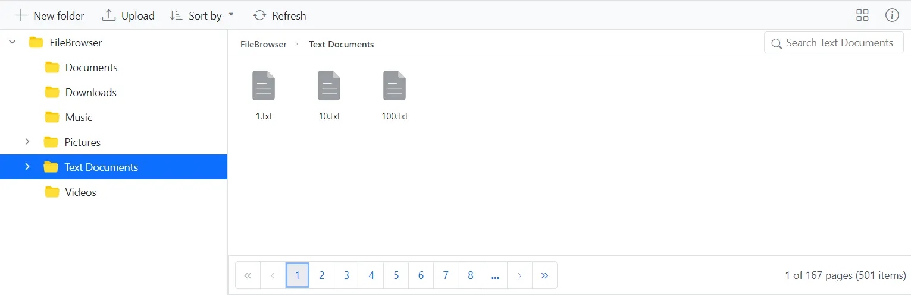
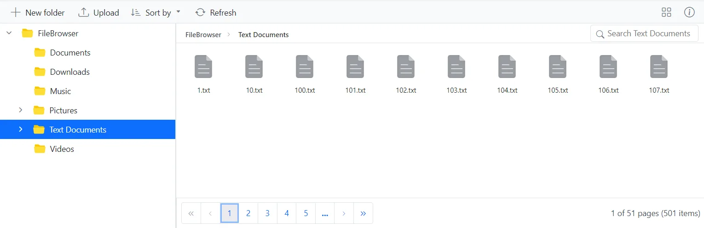
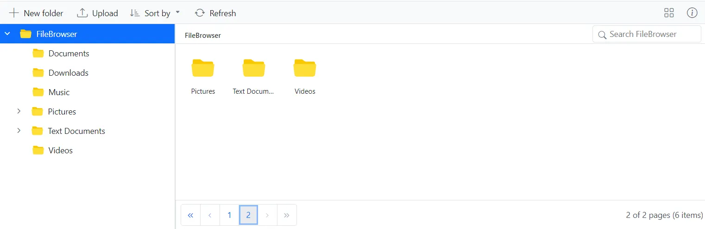
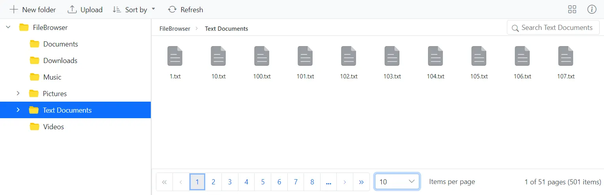
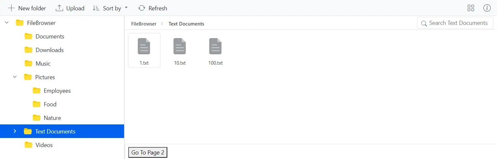

## Prerequisites

Before enabling pagination, ensure the Syncfusion Blazor File Manager is installed and configured in your project. If you have not yet set it up, refer to the [Getting Started with Blazor Server App](getting-started-with-server-app.md) or [Getting Started with Blazor WebAssembly App](getting-started-with-wasm-app.md) documentation for step-by-step setup, including:

- Installing the required NuGet packages: `Syncfusion.Blazor.FileManager` and `Syncfusion.Blazor.Themes`.
- Adding `@using Syncfusion.Blazor.FileManager` to your `_Imports.razor` file.
- Registering Syncfusion Blazor services in `Program.cs` using `builder.Services.AddSyncfusionBlazor()`.
- Referencing the theme stylesheet (for example, `material.css`) in `~/_Layout.cshtml` (Server) or `wwwroot/index.html` (WebAssembly).

# Pagination in Blazor File Manager

Pagination provides an option to display files and folders in segmented pages, making it easier to navigate through large directories. This feature is particularly useful when dealing with extensive file systems in the [Blazor File Manager](https://www.syncfusion.com/blazor-components/blazor-file-manager) component.

To enable pagination, you need to set the [AllowPaging](https://help.syncfusion.com/cr/blazor/Syncfusion.Blazor.FileManager.SfFileManager-1.html#Syncfusion_Blazor_FileManager_SfFileManager_1_AllowPaging) property to **true**. When `AllowPaging` is `true`, pagination is enabled and a pager control is rendered at the bottom of the File Manager, allowing you to navigate through different pages. When `false`, pagination is disabled and all items are rendered in a single view. **Default value:** `false`.

> The service URL (`https://physical-service.syncfusion.com/api/Virtualization/...`) used in the samples below is a public demo endpoint. In your application, replace it with the URL of your own File Manager service provider.

`TValue` specifies the data model used by the File Manager. In all the samples in this document, `TValue` is set to `FileManagerDirectoryContent`, which is the built-in model that represents the directory and file content returned by the service.

## Customize the pagination options

You can tailor the pager according to your requirements. You can control the number of pages shown using the `NumericItemsCount` property, change the current page using the `CurrentPage` property, control the number of records displayed per page using the `PageSize` property, and adjust the available page sizes in the dropdown using the `PageSizes` property.

### Change the page size

The Blazor File Manager allows you to control the number of records displayed per page, providing flexibility in managing your data. Use the [PageSize](https://help.syncfusion.com/cr/blazor/Syncfusion.Blazor.FileManager.FileManagerPageSettings.html#Syncfusion_Blazor_FileManager_FileManagerPageSettings_PageSize) property to set the initial number of records to display on each page. **Default value:** `25`.

The following example demonstrates how to change the page size of the File Manager using the `PageSize` property.

````cshtml
@using Syncfusion.Blazor.FileManager;
@using Syncfusion.Blazor.Navigations;

<SfFileManager  TValue="FileManagerDirectoryContent" AllowPaging="true">
    <FileManagerAjaxSettings Url="https://physical-service.syncfusion.com/api/Virtualization/FileOperations"
                             UploadUrl="https://physical-service.syncfusion.com/api/Virtualization/Upload"
                             DownloadUrl="https://physical-service.syncfusion.com/api/Virtualization/Download"
                             GetImageUrl="https://physical-service.syncfusion.com/api/Virtualization/GetImage">
    </FileManagerAjaxSettings>
    <FileManagerPageSettings PageSize="3"></FileManagerPageSettings>
</SfFileManager>
````
The following screenshot illustrates the `PageSize` property in the Blazor File Manager, showing 3 items per page.



### Change the page count

The [NumericItemsCount](https://help.syncfusion.com/cr/blazor/Syncfusion.Blazor.FileManager.FileManagerPageSettings.html#Syncfusion_Blazor_FileManager_FileManagerPageSettings_NumericItemsCount) property sets the number of numeric buttons displayed in the pager when pagination is enabled. **Default value:** `10`.

 ````cshtml
 @using Syncfusion.Blazor.FileManager;
@using Syncfusion.Blazor.Navigations;
<SfFileManager TValue="FileManagerDirectoryContent" AllowPaging="true" >
    <FileManagerAjaxSettings Url="https://physical-service.syncfusion.com/api/Virtualization/FileOperations"
                             UploadUrl="https://physical-service.syncfusion.com/api/Virtualization/Upload"
                             DownloadUrl="https://physical-service.syncfusion.com/api/Virtualization/Download"
                             GetImageUrl="https://physical-service.syncfusion.com/api/Virtualization/GetImage">
    </FileManagerAjaxSettings>
    <FileManagerPageSettings NumericItemsCount="5"></FileManagerPageSettings>
</SfFileManager>
 ````

The following screenshot illustrates the `NumericItemsCount` property in the Blazor File Manager, showing 5 numeric buttons in the pager.



### Change the current page

The Blazor File Manager allows you to change the currently displayed page. This is useful when you need to set a specific page on initial render, or to update the displayed page based on user interactions or other conditions. **Default value:** `1`.

Use the [CurrentPage](https://help.syncfusion.com/cr/blazor/Syncfusion.Blazor.FileManager.FileManagerPageSettings.html#Syncfusion_Blazor_FileManager_FileManagerPageSettings_CurrentPage) property in the [FileManagerPageSettings](https://help.syncfusion.com/cr/blazor/Syncfusion.Blazor.FileManager.FileManagerPageSettings.html) component to define the current page number of the pager.

The following example demonstrates how to use the `CurrentPage` property.

````cshtml
@using Syncfusion.Blazor.FileManager;
@using Syncfusion.Blazor.Navigations;

<SfFileManager TValue="FileManagerDirectoryContent" AllowPaging="true">
    <FileManagerAjaxSettings Url="https://physical-service.syncfusion.com/api/Virtualization/FileOperations"
                             UploadUrl="https://physical-service.syncfusion.com/api/Virtualization/Upload"
                             DownloadUrl="https://physical-service.syncfusion.com/api/Virtualization/Download"
                             GetImageUrl="https://physical-service.syncfusion.com/api/Virtualization/GetImage">
    </FileManagerAjaxSettings>
    <FileManagerPageSettings PageSize="3" CurrentPage="2">
       
    </FileManagerPageSettings>
</SfFileManager>
````
The following screenshot illustrates the `CurrentPage` property in the Blazor File Manager, with the pager initially displaying page 2.




### Pager with Page Sizes dropdown

The [PageSizes](https://help.syncfusion.com/cr/blazor/Syncfusion.Blazor.FileManager.FileManagerPageSettings.html#Syncfusion_Blazor_FileManager_FileManagerPageSettings_PageSizes) property of the [FileManagerPageSettings](https://help.syncfusion.com/cr/blazor/Syncfusion.Blazor.FileManager.FileManagerPageSettings.html) component enables a dropdown in the pager that lets users dynamically change the number of records displayed per page. **Default value:** an empty list, in which case the dropdown is not rendered.

The following sample demonstrates how the `PageSizes` property is used when pagination is enabled in the Blazor File Manager.

````cshtml

@using Syncfusion.Blazor.FileManager

    <SfFileManager TValue="FileManagerDirectoryContent" AllowPaging="true" Path="/Text Documents/">
        <FileManagerAjaxSettings Url="https://physical-service.syncfusion.com/api/Virtualization/FileOperations"
                                 UploadUrl="https://physical-service.syncfusion.com/api/Virtualization/Upload"
                                 DownloadUrl="https://physical-service.syncfusion.com/api/Virtualization/Download"
                                 GetImageUrl="https://physical-service.syncfusion.com/api/Virtualization/GetImage">
        </FileManagerAjaxSettings>
        <FileManagerPageSettings PageSizes="@(new List<int>(){10,25,50})"></FileManagerPageSettings>
    </SfFileManager>

````

The following screenshot shows the page sizes dropdown in the Blazor File Manager, with the available options of 10, 25, and 50 items per page.



## Pager template in Blazor File Manager

The [Template](https://help.syncfusion.com/cr/blazor/Syncfusion.Blazor.FileManager.FileManagerPageSettings.html#Syncfusion_Blazor_FileManager_FileManagerPageSettings_Template) property in the [FileManagerPageSettings](https://help.syncfusion.com/cr/blazor/Syncfusion.Blazor.FileManager.FileManagerPageSettings.html) component lets you insert custom UI elements, such as buttons or any HTML fragments, into the pager. This offers greater flexibility for customizing the paging interface.

### How to navigate to a particular page

Use the [GoToPageAsync](https://help.syncfusion.com/cr/blazor/Syncfusion.Blazor.FileManager.SfFileManager-1.html#Syncfusion_Blazor_FileManager_SfFileManager_1_GoToPageAsync_System_Int32_) method on the File Manager reference from within the pager template, passing the desired page number, to navigate to that page.

The following example demonstrates how to customize pagination by adding a custom button in the pager template that calls [GoToPageAsync](https://help.syncfusion.com/cr/blazor/Syncfusion.Blazor.FileManager.SfFileManager-1.html#Syncfusion_Blazor_FileManager_SfFileManager_1_GoToPageAsync_System_Int32_) to jump to page 2.

````cshtml
@using Syncfusion.Blazor.FileManager;
@using Syncfusion.Blazor.Navigations;
<SfFileManager @ref="fileManager" TValue="FileManagerDirectoryContent" AllowPaging="true">
    <FileManagerAjaxSettings Url="https://physical-service.syncfusion.com/api/Virtualization/FileOperations"
                             UploadUrl="https://physical-service.syncfusion.com/api/Virtualization/Upload"
                             DownloadUrl="https://physical-service.syncfusion.com/api/Virtualization/Download"
                             GetImageUrl="https://physical-service.syncfusion.com/api/Virtualization/GetImage">
    </FileManagerAjaxSettings>
    <FileManagerPageSettings PageSize="3">
        <Template>
            <button @onclick="NavigateToPage">Go To Page 2</button>
        </Template>
    </FileManagerPageSettings>
</SfFileManager>
@code {
    SfFileManager<FileManagerDirectoryContent> fileManager;
    
    private async Task NavigateToPage()
    { 
        await fileManager.GoToPageAsync(2);
    }
}

````

The following screenshot shows the Blazor File Manager with a custom **Go To Page 2** button in the pager.



## Events in pagination

The Blazor File Manager provides events to handle actions during pagination.

The [PageChanging](https://help.syncfusion.com/cr/blazor/Syncfusion.Blazor.FileManager.FileManagerEvents-1.html#Syncfusion_Blazor_FileManager_FileManagerEvents_1_PageChanging) event triggers before the page is changed, allowing you to handle actions before navigation. Set `args.Cancel` to `true` in the event handler to cancel the page change. The handler receives a `PageChangingEventArgs` argument that exposes properties such as `CurrentPage` (the page the user is navigating to) and `PreviousPage` (the page currently shown).

The [PageChanged](https://help.syncfusion.com/cr/blazor/Syncfusion.Blazor.FileManager.FileManagerEvents-1.html#Syncfusion_Blazor_FileManager_FileManagerEvents_1_PageChanged) event triggers after the page has been switched, allowing you to perform actions such as loading new data once the page has changed. The handler receives a `PageChangedEventArgs` argument that exposes the `CurrentPage` property.

````cshtml
@using Syncfusion.Blazor.FileManager;
@using Syncfusion.Blazor.Navigations;
<SfFileManager TValue="FileManagerDirectoryContent" AllowPaging="true">
    <FileManagerAjaxSettings Url="https://physical-service.syncfusion.com/api/Virtualization/FileOperations"
                             UploadUrl="https://physical-service.syncfusion.com/api/Virtualization/Upload"
                             DownloadUrl="https://physical-service.syncfusion.com/api/Virtualization/Download"
                             GetImageUrl="https://physical-service.syncfusion.com/api/Virtualization/GetImage">
    </FileManagerAjaxSettings>
    <FileManagerEvents TValue="FileManagerDirectoryContent" PageChanging="OnChanging" PageChanged="OnChanged"></FileManagerEvents>
</SfFileManager>
@code {

    public void OnChanging(PageChangingEventArgs args)
    {
        //Add the required code here
    }
    public void OnChanged(PageChangedEventArgs args)
    {
        //Add the required code here
    }
}

````

> **Note:** The pagination feature is available in Syncfusion Blazor File Manager from the specified version onward and is compatible with .NET 6, .NET 7, and .NET 8. If the pager does not render, verify that `AllowPaging` is set to `true` and that the `FileManagerPageSettings` child component is placed inside the `SfFileManager` component.