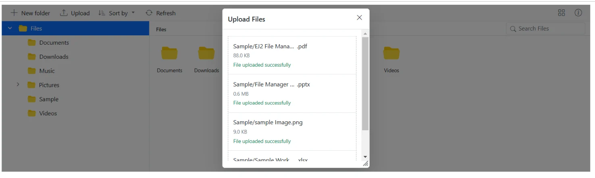
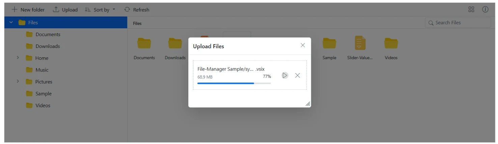
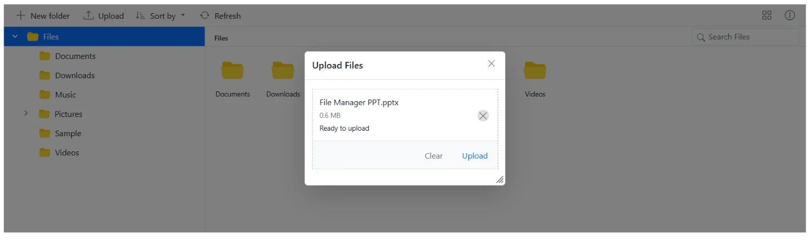
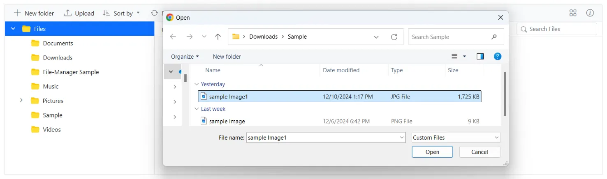

# Upload in Blazor File Manager

The [Blazor File Manager](https://www.syncfusion.com/blazor-components/blazor-file-manager) component provides a [FileManagerUploadSettings](https://help.syncfusion.com/cr/blazor/Syncfusion.Blazor.FileManager.FileManagerUploadSettings.html) property with various options to customize how files are uploaded, such as controlling file size, restricting file types, and enabling chunk uploads.

## Prerequisites

Before configuring upload, install the Syncfusion Blazor File Manager package and register Syncfusion in your application:

- Target framework: .NET 6.0 or later.
- NuGet package: `Syncfusion.Blazor.FileManager` (latest stable release).
- Register Syncfusion in `Program.cs` using `builder.Services.AddSyncfusionBlazor()` and add the script, stylesheet, and theme references as described in the [Getting Started](getting-started.md) guide.

N> The `https://physical-service.syncfusion.com/...` URLs used in the examples on this page are demo endpoints hosted by Syncfusion. Replace them with your own service URLs before deploying to production.

## Directory Upload

The [DirectoryUpload](https://help.syncfusion.com/cr/blazor/Syncfusion.Blazor.FileManager.FileManagerUploadSettings.html#Syncfusion_Blazor_FileManager_FileManagerUploadSettings_DirectoryUpload) property controls whether users can browse and upload entire directories (folders) in the Blazor File Manager component. 

To enable directory upload, set the `DirectoryUpload` property to `true` in the [FileManagerUploadSettings](https://help.syncfusion.com/cr/blazor/Syncfusion.Blazor.FileManager.FileManagerUploadSettings.html) configuration.

When set to `true`, this property enables directory upload in the FileManager, allowing users to upload entire folders. If set to `false`, only individual files can be uploaded.

```cshtml

@using Syncfusion.Blazor.FileManager

<SfFileManager TValue="FileManagerDirectoryContent">
    <FileManagerUploadSettings DirectoryUpload  = "true"></FileManagerUploadSettings>
    <FileManagerAjaxSettings Url="https://physical-service.syncfusion.com/api/FileManager/FileOperations"
                             UploadUrl="https://physical-service.syncfusion.com/api/FileManager/Upload"
                             DownloadUrl="https://physical-service.syncfusion.com/api//FileManager/Download"
                             GetImageUrl="https://physical-service.syncfusion.com/api/test/FileManager/GetImage">
    </FileManagerAjaxSettings>
</SfFileManager>

```
N> When `DirectoryUpload` is set to `true`, only folders can be uploaded. When it is set to `false`, only individual files can be uploaded. Simultaneous uploading of files and folders is not supported.

N> Directory upload relies on the HTML5 `webkitdirectory` / `directory` attribute. The application must be served over HTTPS (browsers restrict directory selection to secure contexts) and must be opened in a browser that supports folder selection (recent versions of Chrome, Edge, Firefox, or Safari 14+).

The screenshot below shows that after a directory is successfully selected, all files inside it are uploaded automatically. This demonstrates how the `DirectoryUpload` property works in the Blazor File Manager component.



## Sequential Upload

The [SequentialUpload](https://help.syncfusion.com/cr/blazor/Syncfusion.Blazor.FileManager.FileManagerUploadSettings.html#Syncfusion_Blazor_FileManager_FileManagerUploadSettings_SequentialUpload) property controls whether users can upload files one by one in a sequential manner. 

To enable sequential upload, set the `SequentialUpload` property to `true` in the [FileManagerUploadSettings](https://help.syncfusion.com/cr/blazor/Syncfusion.Blazor.FileManager.FileManagerUploadSettings.html) configuration.

When set to `true`, the selected files are uploaded sequentially (one after the other) to the server. If a file uploads successfully or fails, the next file is uploaded automatically. This feature helps to reduce the upload traffic and lowers the chance of upload failures.

```cshtml

@using Syncfusion.Blazor.FileManager

<SfFileManager TValue="FileManagerDirectoryContent">
    <FileManagerUploadSettings SequentialUpload  = "true"></FileManagerUploadSettings>
    <FileManagerAjaxSettings Url="https://physical-service.syncfusion.com/api/FileManager/FileOperations"
                             UploadUrl="https://physical-service.syncfusion.com/api/FileManager/Upload"
                             DownloadUrl="https://physical-service.syncfusion.com/api//FileManager/Download"
                             GetImageUrl="https://physical-service.syncfusion.com/api/test/FileManager/GetImage">
    </FileManagerAjaxSettings>
</SfFileManager>

```
The screenshot below shows that each file begins uploading only after the previous one completes. This demonstrates how the `SequentialUpload` property works in the Blazor File Manager component.


## Chunk Upload

The [ChunkSize](https://help.syncfusion.com/cr/blazor/Syncfusion.Blazor.FileManager.FileManagerUploadSettings.html#Syncfusion_Blazor_FileManager_FileManagerUploadSettings_ChunkSize) property specifies the size of each chunk when uploading large files. It divides the file into smaller parts, which are uploaded sequentially to the server

This property allows you to enable chunked uploads for large files by specifying a `ChunkSize`.

By specifying a `ChunkSize`, the large file is divided into smaller parts, reducing the load on the network and making the upload process more efficient.

N> `ChunkSize` must be a positive value in bytes. A value of at least 1 MiB (1,048,576 bytes) is recommended for reliable uploads. `MaxFileSize` is also expressed in bytes; setting it to `0` (the default) removes the upper size limit.

```cshtml

@using Syncfusion.Blazor.FileManager

<SfFileManager TValue="FileManagerDirectoryContent">
    <FileManagerUploadSettings DirectoryUpload="true" ChunkSize="5242880" MaxFileSize="73728000"></FileManagerUploadSettings>
    <FileManagerAjaxSettings Url="https://physical-service.syncfusion.com/api/FileManager/FileOperations"
                             UploadUrl="https://physical-service.syncfusion.com/api/FileManager/Upload"
                             DownloadUrl="https://physical-service.syncfusion.com/api//FileManager/Download"
                             GetImageUrl="https://physical-service.syncfusion.com/api/test/FileManager/GetImage">
    </FileManagerAjaxSettings>
</SfFileManager>

```
In the following example, the `ChunkSize` is set to 5 MiB (5,242,880 bytes), and the `MaxFileSize` is set to about 70 MiB (73,728,000 bytes). This means files up to roughly 70 MiB will be uploaded in 5 MiB chunks.

With chunk upload, the pause and resume options gives users enhanced control over the file upload process.



## Auto Upload

The [AutoUpload](https://help.syncfusion.com/cr/blazor/Syncfusion.Blazor.FileManager.FileManagerUploadSettings.html#Syncfusion_Blazor_FileManager_FileManagerUploadSettings_AutoUpload) property controls whether files are automatically uploaded when they are added to the upload queue in the Blazor File Manager component.

The default value is `true`, the Blazor File Manager will automatically upload files as soon as they are added to the upload queue. If set to `false`, the files will not be uploaded automatically, giving you the chance to manipulate the files before uploading them to the server.

```cshtml

@using Syncfusion.Blazor.FileManager

<SfFileManager TValue="FileManagerDirectoryContent">
    <FileManagerUploadSettings AutoUpload = "false"></FileManagerUploadSettings>
    <FileManagerAjaxSettings Url="https://physical-service.syncfusion.com/api/FileManager/FileOperations"
                             UploadUrl="https://physical-service.syncfusion.com/api/FileManager/Upload"
                             DownloadUrl="https://physical-service.syncfusion.com/api//FileManager/Download"
                             GetImageUrl="https://physical-service.syncfusion.com/api/test/FileManager/GetImage">
    </FileManagerAjaxSettings>
</SfFileManager>

```

The screenshot demonstrates the AutoUpload property set to `false`. When disabled, files are added to the queue without being automatically uploaded, and the `Upload` and `Clear` buttons remain visible for manual control.



## Auto Close

The [AutoClose](https://help.syncfusion.com/cr/blazor/Syncfusion.Blazor.FileManager.FileManagerUploadSettings.html#Syncfusion_Blazor_FileManager_FileManagerUploadSettings_AutoClose) property controls whether the upload dialog automatically closes after all the files have been uploaded.

The default value is set to `false`, the upload dialog remains open even after the upload process is complete. If `AutoClose` set to `true`, the upload dialog will automatically close after all the files in the upload queue are uploaded.

```cshtml

@using Syncfusion.Blazor.FileManager

<SfFileManager TValue="FileManagerDirectoryContent">
    <FileManagerUploadSettings  AutoClose="true"></FileManagerUploadSettings>
    <FileManagerAjaxSettings Url="https://physical-service.syncfusion.com/api/FileManager/FileOperations"
                             UploadUrl="https://physical-service.syncfusion.com/api/FileManager/Upload"
                             DownloadUrl="https://physical-service.syncfusion.com/api//FileManager/Download"
                             GetImageUrl="https://physical-service.syncfusion.com/api/test/FileManager/GetImage">
    </FileManagerAjaxSettings>
</SfFileManager>

```

## Prevent upload based on file extensions

The [AllowedExtensions](https://help.syncfusion.com/cr/blazor/Syncfusion.Blazor.FileManager.FileManagerUploadSettings.html#Syncfusion_Blazor_FileManager_FileManagerUploadSettings_AllowedExtensions) property specifies which file types are allowed for upload in the File Manager component by defining their extensions.

This property lets you define which file types can be uploaded by specifying allowed extensions, separated by commas. For example, to allow only image files, you would set the `AllowedExtensions` property to .jpg,.png.

By setting the `AllowedExtensions` property, you restrict the file types that can be uploaded. Only files with the specified extensions will be accepted.

If you want to allow only image files like .jpg and .png, you would set the property as follows:

```cshtml

@using Syncfusion.Blazor.FileManager

<SfFileManager TValue="FileManagerDirectoryContent">
    <FileManagerUploadSettings  AllowedExtensions=".jpg,.png"></FileManagerUploadSettings>
    <FileManagerAjaxSettings Url="https://physical-service.syncfusion.com/api/FileManager/FileOperations"
                             UploadUrl="https://physical-service.syncfusion.com/api/FileManager/Upload"
                             DownloadUrl="https://physical-service.syncfusion.com/api//FileManager/Download"
                             GetImageUrl="https://physical-service.syncfusion.com/api/test/FileManager/GetImage">
    </FileManagerAjaxSettings>
</SfFileManager>

```


## Upload Mode

The [UploadMode](https://help.syncfusion.com/cr/blazor/Syncfusion.Blazor.FileManager.FileManagerUploadSettings.html#Syncfusion_Blazor_FileManager_FileManagerUploadSettings_UploadMode) property defines the method used to perform the upload operation in the Blazor File Manager component.

This property lets you choose between two upload modes. `FormSubmit` Uses the traditional form submission method for file uploads.
`HttpClient` uses the HttpClient instance for the upload, providing more control over the request.

By default, the `UploadMode` is set to `FormSubmit`, but you can switch to HttpClient for more control, such as managing headers or authorizing the upload response.

N> The `HttpClient` upload mode requires `IHttpClientFactory` to be registered in the dependency-injection container (for example `builder.Services.AddHttpClient()` in `Program.cs`). The `IApiAuthTokenService` interface and the `TokenRequestModel` / `TokenResponseModel` types referenced by the sample `ApiAuthTokenService` are not part of Syncfusion and must be defined and registered in your project, for example `builder.Services.AddScoped<IApiAuthTokenService, ApiAuthTokenService>()`.




@using Microsoft.AspNetCore.Components;
@using Syncfusion.Blazor.FileManager;
@using System.Net.Http.Headers;

<SfFileManager TValue="FileManagerDirectoryContent">
    <FileManagerUploadSettings  UploadMode="UploadMode.HttpClient"></FileManagerUploadSettings>
    <FileManagerEvents TValue="FileManagerDirectoryContent" OnSend="OnBeforeSend"></FileManagerEvents>
    <FileManagerAjaxSettings Url="https://physical-service.syncfusion.com/api/FileManager/FileOperations"
                             UploadUrl="https://physical-service.syncfusion.com/api/FileManager/Upload"
                             DownloadUrl="https://physical-service.syncfusion.com/api//FileManager/Download"
                             GetImageUrl="https://physical-service.syncfusion.com/api/test/FileManager/GetImage">
    </FileManagerAjaxSettings>
</SfFileManager>

@code { 

    private IApiAuthTokenService ApiAuthTokenService { get; set; }
    
    private async Task OnBeforeSend(BeforeSendEventArgs args)
    {
        var token = await ApiAuthTokenService.GetToken();
        args.HttpClientInstance.DefaultRequestHeaders.Add("Authorization", "Bearer " + token);
    }
}







namespace Blazor
{
    public class ApiAuthTokenService : IApiAuthTokenService
    {
        private readonly IHttpClientFactory _httpClientFactory;
        private string _token;
        private int _expiresIn = 3600;
        private DateTime? _requestTime;

        public ApiAuthTokenService(IHttpClientFactory httpClientFactory)
        {
            _httpClientFactory = httpClientFactory;
        }

        public async Task<string> GetToken()
        {
            if (!string.IsNullOrWhiteSpace(_token) && _requestTime != null)
            {
                var expiryTimeStamp = _requestTime.Value.AddSeconds(_expiresIn);
                var oneMinuteAgo = DateTime.Now.AddMinutes(-1);

                if (expiryTimeStamp < oneMinuteAgo)
                {
                    return _token;
                }
            }

            _requestTime = DateTime.Now;
            var httpClient = _httpClientFactory.CreateClient();

            var uri = new Uri("https://localhost:7218/login?useCookies=false&useSessionCookies=false");

            var response = await httpClient.PostAsJsonAsync(uri, new TokenRequestModel()
            {
                Email = string.Empty,
                Password = string.Empty,
                TwoFactorCode = string.Empty,
                TwoFactorRecoveryCode = string.Empty
            });

            var apiResponse = await response.Content.ReadFromJsonAsync<TokenResponseModel>();

            _expiresIn = apiResponse.ExpiresIn;
            _token = apiResponse.AccessToken;

            return _token;
        }
    }
}




N> The `HttpClient` upload mode requires `IHttpClientFactory` to be registered in the DI container (`builder.Services.AddHttpClient()`). The `IApiAuthTokenService` interface and the `TokenRequestModel` / `TokenResponseModel` types referenced by the sample `ApiAuthTokenService` are not part of Syncfusion and must be defined in your project. Register the auth service with the container, for example `builder.Services.AddScoped<IApiAuthTokenService, ApiAuthTokenService>()`.

## Drag and Drop upload

The Blazor File Manager component allows you to easily perform drag and drop file uploads. You can drag files from your local file system and drop them directly into the FileManager. Additionally, you have the ability to customize the drop area for file uploads using the [DropArea](https://help.syncfusion.com/cr/blazor/Syncfusion.Blazor.FileManager.FileManagerUploadSettings.html#Syncfusion_Blazor_FileManager_FileManagerUploadSettings_DropArea) property in the [FileManagerUploadSettings](https://help.syncfusion.com/cr/blazor/Syncfusion.Blazor.FileManager.FileManagerUploadSettings.html) class.

```cshtml

@using Syncfusion.Blazor.FileManager

<SfFileManager TValue="FileManagerDirectoryContent">
    <FileManagerAjaxSettings Url="https://physical-service.syncfusion.com/api/FileManager/FileOperations"
                             UploadUrl="https://physical-service.syncfusion.com/api/FileManager/Upload"
                             DownloadUrl="https://physical-service.syncfusion.com/api/FileManager/Download"
                             GetImageUrl="https://physical-service.syncfusion.com/api/FileManager/GetImage">
    </FileManagerAjaxSettings>
    <FileManagerUploadSettings DropArea=".e-layout-content"></FileManagerUploadSettings>
</SfFileManager>

```

## See also

* [Set min and max file size in upload](https://blazor.syncfusion.com/documentation/file-manager/how-to/upload-large-files)

* [Restrict drag and drop upload](https://blazor.syncfusion.com/documentation/file-manager/how-to/restrict-drag-and-drop-upload)
