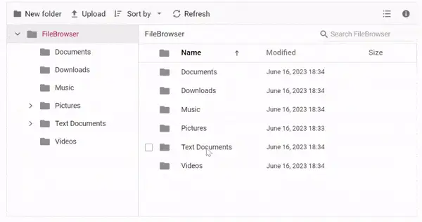

# Virtualization in Blazor File Manager

The [Blazor File Manager](https://www.syncfusion.com/blazor-components/blazor-file-manager) UI virtualization allows dynamic loading of a large number of directories and files in both the Details and LargeIcons view types without degrading performance. Virtualization of the Blazor File Manager component is based on the height and width of the viewport. Items are loaded in both the Details and LargeIcons views based on the viewport size.

## Prerequisites

Before enabling virtualization, ensure the Syncfusion Blazor File Manager is installed and registered. For NuGet packages, theme setup, and `Program.cs` registration, see [Getting Started with the Blazor Web App](getting-started-with-web-app.md) (or the equivalent guide for [Server](getting-started-with-server-app.md), [WASM](getting-started-with-wasm-app.md), or [MAUI](getting-started-with-maui-app.md) hosts). The endpoints used in this sample also require a server-side [file system provider](file-system-provider.md) implementation.

> When using the hosted demo service (`https://physical-service.syncfusion.com`), verify that your client origin is allowed by its CORS policy.

## Enable Virtualization

In order to enable virtualization, set the [EnableVirtualization](https://help.syncfusion.com/cr/blazor/Syncfusion.Blazor.FileManager.SfFileManager-1.html#Syncfusion_Blazor_FileManager_SfFileManager_1_EnableVirtualization) property to `true`. The default value is `false`. Enabling virtualization is recommended when working with directories that contain hundreds or thousands of files. The property applies to both the Details and LargeIcons view types; switch to the LargeIcons view by setting `View="ViewType.LargeIcons"` in the example below.

Virtualization interacts with the following settings:

* [View](https://help.syncfusion.com/cr/blazor/Syncfusion.Blazor.FileManager.SfFileManager-1.html#Syncfusion_Blazor_FileManager_SfFileManager_1_View) — enables virtualized rendering in the `Details` and `LargeIcons` view types.
* [PageSize](https://help.syncfusion.com/cr/blazor/Syncfusion.Blazor.FileManager.SfFileManager-1.html#Syncfusion_Blazor_FileManager_SfFileManager_1_PageSize) — controls the number of items fetched per request from the server.
* Search and filtering — operate only on items currently rendered in the viewport.

The following example demonstrates virtualization enabled in the Details view.

```cshtml

@using Syncfusion.Blazor.FileManager

<SfFileManager TValue="FileManagerDirectoryContent" View="ViewType.Details" EnableVirtualization="true">
        <FileManagerAjaxSettings Url="https://physical-service.syncfusion.com/api/Virtualization/FileOperations"
                                 UploadUrl="https://physical-service.syncfusion.com/api/Virtualization/Upload"
                                 DownloadUrl="https://physical-service.syncfusion.com/api/Virtualization/Download"
                                 GetImageUrl="https://physical-service.syncfusion.com/api/Virtualization/GetImage">
        </FileManagerAjaxSettings>        
    </SfFileManager>

```


The below image demonstrates file loading when virtualization is enabled. A sizable collection of files can be found in the **Documents** and **Text Documents** folders.



## When to Use Virtualization

Virtualization is particularly beneficial in the following scenarios:

* File systems with hundreds or thousands of files in a single directory.
* Applications where File Manager needs to load quickly without performance degradation.
* Environments with limited memory resources where rendering large collections could impact performance.

## Compatibility

The Blazor File Manager and the `EnableVirtualization` property are supported in Syncfusion Blazor assemblies targeting .NET 6.0 and later, including .NET 8.0 (LTS) and .NET 9.0. Virtualization works in Blazor Web App, Blazor Server, Blazor WebAssembly, and .NET MAUI Blazor hosts. For the specific version that introduced virtualization support, see the [Blazor File Manager Release Notes](https://www.syncfusion.com/releases/whats-new/syncfusion-essential-studio-blazor).

## Limitations for Virtualization

* Programmatic selection using the [**SelectAllAsync**](https://help.syncfusion.com/cr/blazor/Syncfusion.Blazor.FileManager.SfFileManager-1.html#Syncfusion_Blazor_FileManager_SfFileManager_1_SelectAllAsync) method is not supported with virtual scrolling.
* The keyboard shortcut **CTRL+A** selects only the files and directories that are currently visible within the viewport, rather than selecting all files and directories in the entire directory tree.
* Selected file items are not retained while scrolling or switching between views, in order to maintain component performance.

## See Also

* [File System Provider in Blazor File Manager](file-system-provider.md)
* [Views in Blazor File Manager](views.md)
* [User Interface in Blazor File Manager](user-interface.md)
* [Getting Started with the Blazor File Manager Web App](getting-started-with-web-app.md)
