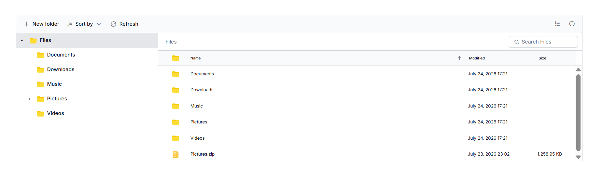

# Getting Started with React File Manager

This section explains how to create and configure the **React File Manager** component in a React application.

To get started quickly with the [React File Manager](https://www.syncfusion.com/react-ui-components/react-file-manager), refer to the video below:







## Prerequisites

- [Node.js 24+](https://nodejs.org/en) (LTS recommended).
- Syncfusion CLI.

## Install the Syncfusion CLI 

Install the Syncfusion CLI globally using the following command:



npm install -g @syncfusion/syncfusion-cli



## Set up the Vite project using Syncfusion CLI

You can create a React Vite application using the Syncfusion CLI. The CLI provides two ways to create a project:

### Non-interactive mode

Non-interactive mode allows you to create a project directly using a single command with the required command-line arguments.



sf new my-app --framework react --template file-manager --theme tailwind3



In this mode, the project configuration is passed directly in the command. The above command creates a React Vite application configured with the Syncfusion<sup style="font-size:70%">&reg;</sup> `React File Manager` component.

### Interactive mode

Interactive mode guides you through the project creation process with step-by-step prompts.



sf



When you run the `sf` command, the CLI prompts you to select the required project configuration. To create a React Vite application with the Syncfusion<sup style="font-size:70%">&reg;</sup> `File Manager` component, select the following options:




√ Project name? ... my-app
√ Choose Framework: » React
√ Choose Build Tool: » Vite
√ Choose Language: » JavaScript
√ Choose Template: » File Manager
√ Choose Theme: » Tailwind3
√ Choose Style Format: » CSS
√ Would you like to integrate the Syncfusion MCP Server (AI Assistant) into this project? ... no
√ Would you like to install Syncfusion Component Skills for AI-powered development? ... no      
√ Install dependencies and start app now? ... no




The above selections generate a React Vite application configured with the Syncfusion<sup style="font-size:70%">&reg;</sup> `React File Manager` component. You can choose different values for language, theme, style format, MCP setup, and skills installation based on your project requirements.

The Syncfusion<sup style="font-size:70%">&reg;</sup> CLI creates the project with a predefined template. After the project is generated, you can customize or replace the component code based on your application requirements.

## Run the project

Once the project is created, navigate to the project directory and run the following commands in your terminal.



cd my-app
npm install
npm run dev



The output will appear as follows:







## Prerequisites

| Requirement | Version |
|-------------|---------|
| React | 15.5.4 or higher |
| Node.js | 14.0.0 or above |
| Yarn (optional) | 0.25 or above |

### React supported versions

| React version | Minimum Syncfusion React File Manager version |
| ------------- | ------------------------------------------- |
| [React v19](https://react.dev/blog/2024/12/05/react-19) | 29.1.33 and above |
| [React v18](https://reactjs.org/blog/2022/03/29/react-v18.html) | 20.2.36 and above |
| [React v17](https://reactjs.org/blog/2020/10/20/react-v17.html) | 18.3.50 and above |
| [React v16](https://reactjs.org/blog/2017/09/26/react-v16.0.html) | 16.2.45 and above |

### Browser Support

| Browser | Supported versions |
|---|---|
| Chrome | Latest |
| Firefox | Latest |
| Opera | Latest |
| Edge | 13+ |
| Internet Explorer (IE) | 11+ |
| Safari | 9+ |
| iOS Safari | 9+ |
| Android Browser / Chrome for Android | 4.4+ |
| Windows Mobile | IE 11+ |

## Setup for local development

Easily set up a React application using `create-vite-app`, which provides a faster development environment, smaller bundle sizes, and optimized builds compared to traditional tools like `create-react-app`. For detailed steps, refer to the Vite [installation instructions](https://vitejs.dev/guide). Vite sets up your environment using JavaScript and optimizes your application for production.

> **Note:**  To create a React application using `create-react-app`, refer to this [documentation](https://ej2.syncfusion.com/react/documentation/getting-started/create-app) for more details.

To create a new React application, run one of the following commands based on your preferred language:

***React with JavaScript***

```bash
npx create-vite@latest my-app -- --template react
```

***React with TypeScript***

```bash
npx create-vite@latest my-app -- --template react-ts
```

During the setup process, the CLI will prompt you for a few configuration options. Select the following:

- **Which linter to use?** → **ESLint**
- **Install with npm and start now?** → **Yes**

Selecting **Yes** automatically installs the project dependencies and starts the development server.

After verifying that the application starts successfully, terminate the development server in the terminal and proceed to the next step.

Then, navigate to the project directory:

```bash
cd my-app
```

## Adding React File Manager packages

To install the React File Manager component, use the following command:

```bash
npm i @syncfusion/ej2-react-filemanager
```

## Adding CSS reference

Themes for Syncfusion<sup style="font-size:70%">&reg;</sup> React File Manager component can be applied using CSS files provided through [npm theme packages](https://www.npmjs.com/package/@syncfusion/ej2-tailwind3-theme). For available themes, refer to the [Themes](https://ej2.syncfusion.com/react/documentation/appearance/theme) documentation.

Install the **Tailwind 3** theme package using the following command:




npm install @syncfusion/ej2-tailwind3-theme --save




Then add the following CSS reference to the **src/App.css** file:




@import "../node_modules/@syncfusion/ej2-tailwind3-theme/styles/file-manager/index.css";




To reference `App.css` in the application, import it into the `src/App.tsx` file. Also, remove any unnecessary styles from `src/index.css` and `src/App.css`, as they may affect the React File Manager component UI.

> **Note:** If you want to use combined component styles, make use of the [Custom Resource Generator (CRG)](https://crg.syncfusion.com) in your application.

## Adding React File Manager component

The React File Manager component code should be placed in the **src/App.tsx** file.

To enable file operation functionality in the React File Manager, configure the [url](https://ej2.syncfusion.com/react/documentation/api/file-manager/ajaxsettingsmodel#url) property within the [ajaxSettings](https://ej2.syncfusion.com/react/documentation/api/file-manager/ajaxsettings). This URL handles the file operation requests from the server.
















### Server-side setup

The sample uses `https://physical-service.syncfusion.com/` as the [`url`](https://ej2.syncfusion.com/react/documentation/api/file-manager/ajaxsettingsmodel#url) endpoint in [`ajaxSettings`](https://ej2.syncfusion.com/react/documentation/api/file-manager/ajaxsettings).

To use your own files, host a React File Manager service and replace the `url` value with your service endpoint. See the [File System Provider](./file-system-provider) documentation for setup details.

## Registering Your Syncfusion License

Generate a license key from the [Syncfusion License Dashboard](https://www.syncfusion.com/account/downloads) and register it before rendering your React application:

```ts
import { registerLicense } from '@syncfusion/ej2-base';

registerLicense('YOUR_LICENSE_KEY');
```

> **Note:** A valid Syncfusion license is required for production use. Without a valid license, a trial license warning message will be displayed.

## Run the application

```bash
npm run dev
```

### Production build

To create an optimized production build:

```bash
npm run build
```

Preview the production build locally:

```bash
npm run preview
```





## Troubleshooting

- **React File Manager not rendering styles:** Ensure the theme CSS is imported in `App.css` and that you removed the default Vite CSS in `index.css`.
- **Trial license warning banner:** Register a license key via `registerLicense()` from `@syncfusion/ej2-base`.
- **Port 5173 already in use:** Stop the conflicting process or run Vite on a different port with `npm run dev -- --port 3000`.

## See also

* [Ajax Settings Configuration (uploadUrl, downloadUrl, getImageUrl)](./file-operations#ajax-settings-configuration)
* [Injecting Services for Overview](./user-interface#injecting-services-for-overview)
* [React File Manager Views](./views)
* [React File Manager File Operations](./file-operations)
* [React File Manager Upload](./upload)
* [React File Manager Customization](./customization)
* [Getting Started with Next.js](./nextjs-getting-started)
