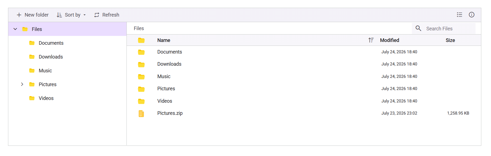

# Getting Started with the Vue File Manager in Vue 3

This article provides a step-by-step guide for setting up a [Vite](https://vitejs.dev) project with a JavaScript environment and integrating the [Vue File Manager](https://www.syncfusion.com/vue-components/vue-file-manager) component using the [Composition API](https://vuejs.org/guide/introduction.html#composition-api) / [Options API](https://vuejs.org/guide/introduction.html#options-api).

The `Composition API` is a new feature introduced in Vue.js 3 that provides an alternative way to organize and reuse component logic. It allows developers to write components as functions that use smaller, reusable functions called composition functions to manage their properties and behavior.

The `Options API` is the traditional way of writing Vue.js components, where the component logic is organized into a series of options that define the component's properties and behavior. These options include data, methods, computed properties, watchers, life cycle hooks, and more.

To get started quickly with Vue File Manager, you can check on this video:






## Prerequisites

- [Node.js 24+](https://nodejs.org/en) (LTS recommended).
- Syncfusion CLI.

## Install the Syncfusion CLI 

Install the Syncfusion CLI globally using the following command:



npm install -g @syncfusion/syncfusion-cli



## Set up the Vite project using Syncfusion CLI

You can create a Vue application with [Vite](https://vite.dev/) using the Syncfusion CLI. The CLI provides two ways to create a project:

### Non-interactive mode

Non-interactive mode allows you to create a project directly using a single command with the required command-line arguments.



sf new my-project --framework vue --template file-manager



In this mode, the project configuration is passed directly in the command. The above command creates a `Vue` application with Vite and configured it with the Syncfusion<sup style="font-size:70%">&reg;</sup> `File Manager` component. The generated project uses the TypeScript and the Composition API.

### Interactive mode

Interactive mode guides you through the project creation process with step-by-step prompts.



sf



When you run the `sf` command, the CLI prompts you to select the required project configuration options. To create a Vue application with Vite and the Syncfusion<sup style="font-size:70%">&reg;</sup> `File Manager` component, select the following options:




√ Project name? ... my-project
√ Choose Framework: » Vue
√ Choose Language: » JavaScript
√ Choose Template: » File Manager
√ Choose Theme: » Material3
√ Choose Style Format: » CSS
√ Would you like to integrate the Syncfusion MCP Server (AI Assistant) into this project? ... no
√ Would you like to install Syncfusion Component Skills for AI-powered development? ... no      
√ Install dependencies and start app now? ... no




The above selections generate a `Vue` application with Vite and configure it with the Syncfusion<sup style="font-size:70%">&reg;</sup> `File Manager` component. You can choose different values for language, theme, style format, MCP setup, and skills installation based on your project requirements.

The Syncfusion<sup style="font-size:70%">&reg;</sup> CLI creates the project with a predefined template. After the project is generated, you can customize or replace the component code based on your application requirements.

## Run the project

Once the project is created, navigate to the project directory and run the following commands in your terminal.



cd my-project
npm install
npm run dev



The output will appear as follows:







## Prerequisites

| Requirement | Version |
|-------------|---------|
| Vue | 2.6 or higher |
| Node.js | 16.0.0 or above |

### Vue supported versions

| Vue version | Minimum Syncfusion Vue File Manager version |
| ------------- | ------------------------------------------- |
|[Vue v2.7](https://blog.vuejs.org/posts/vue-2-7-naruto) | 20.3.47 and above |
|[Vue v3.0](https://blog.vuejs.org/posts/vue-3-as-the-new-default) | 19.2.44 and above |

### Browser Support

| Browser | Supported versions |
|---|---|
| Chrome | Latest |
| Firefox | Latest |
| Opera | Latest |
| Edge | 13+ |
| Internet Explorer (IE) | 11+ |
| Safari | 9+ |
| iOS Safari | 9+ |
| Android Browser / Chrome for Android | 4.4+ |
| Windows Mobile | IE 11+ |

## Set up the Vite project

A recommended approach for beginning with Vue is to scaffold a project using [Vite](https://vitejs.dev). To create a new Vite project, use one of the commands that are specific to either NPM or Yarn.

```bash
npm create vite@latest
```

or

```bash
yarn create vite
```

Using one of the above commands will lead you to set up additional configurations for the project as below:

1.Define the project name: We can specify the name of the project directly. Let's specify the name of the project as `my-project` for this article.

```bash
? Project name: » my-project
```

2.Select `Vue` as the framework. It will create a Vue 3 project.

```bash
? Select a framework: » - Use arrow-keys. Return to submit.
Vanilla
> Vue
  React
  Preact
  Lit
  Svelte
  Others
```

3.Choose `JavaScript` as the framework variant to build this Vite project using JavaScript and Vue.

```bash
? Select a variant: » - Use arrow-keys. Return to submit.
> JavaScript
  TypeScript
  Customize with create-vue ↗
  Nuxt ↗
```

4.Install dependencies and start the dev server.

```bash
Install with npm and start now?: Yes
```

Since you selected `Yes`, the development server should start automatically. If you selected `No`, please follow these steps to set up and start the project manually:

```bash
cd my-project
npm install
```

or

```bash
cd my-project
yarn install
```

Now that `my-project` is ready to run with default settings, let's add Vue components to the project.

## Add Syncfusion<sup style="font-size:70%">&reg;</sup> Vue packages

To install the [Vue File Manager](https://www.syncfusion.com/vue-components/vue-file-manager) component, use the following command:

```bash
npm install @syncfusion/ej2-vue-filemanager --save
```

or

```bash
yarn add @syncfusion/ej2-vue-filemanager
```

## Import Syncfusion<sup style="font-size:70%">&reg;</sup> CSS styles

Themes for Syncfusion<sup style="font-size:70%">&reg;</sup> File Manager components can be applied using CSS files provided through [npm theme packages](https://www.npmjs.com/package/@syncfusion/ej2-material3-theme). For available themes, refer to the [Themes](https://ej2.syncfusion.com/vue/documentation/appearance/theme) documentation.
 
Install the **Material 3** theme package using the following command:



 
npm install @syncfusion/ej2-material3-theme --save
 


 
Then add the following CSS reference to the **src/App.vue** file:




<style>
    @import "../node_modules/@syncfusion/ej2-material3-theme/styles/file-manager/index.css";
</style>




> The order of CSS imports matters. Import base styles first, then component-specific styles. Missing CSS imports can result in misaligned layouts, buttons without styling, or missing visual elements in popups and dialogs.

## Add Syncfusion<sup style="font-size:70%">&reg;</sup> Vue component

Add the following code to the **src/App.vue** file. The Composition API and Options API variants are shown below; choose the one that matches your project style.

To enable file operation functionality in the File Manager, configure the [url](https://ej2.syncfusion.com/vue/documentation/api/file-manager/ajaxsettingsmodel#url) property within the [ajaxSettings](https://ej2.syncfusion.com/vue/documentation/api/file-manager/ajaxsettings). This URL handles the file operation requests from the server.












### Server-side setup

The sample uses `https://physical-service.syncfusion.com/api/FileManager/FileOperations` as the [`url`](https://ej2.syncfusion.com/vue/documentation/api/file-manager/ajaxsettingsmodel#url) endpoint in [`ajaxSettings`](https://ej2.syncfusion.com/vue/documentation/api/file-manager/ajaxsettings).

To use your own files, host a File Manager service and replace the `url` value with your service endpoint. See the [File System Provider](./file-system-provider) documentation for setup details.

## Registering Your Syncfusion License

Generate a license key from the [Syncfusion License Dashboard](https://www.syncfusion.com/account/downloads) and register it before rendering your Vue 3 application:




```javascript
import { registerLicense } from '@syncfusion/ej2-base';

registerLicense('YOUR_LICENSE_KEY');
```




> **Note:** A valid Syncfusion license is required for production use. Without a valid license, a trial license warning message will be displayed.

## Run the project

To run the project, use the following command:

```bash
npm run dev
```

or

```bash
yarn run dev
```

## Production build

To create an optimized production build:

```bash
npm run build
```

Preview the production build locally by serving the generated `dist` folder with a static server:

```bash
npx serve dist
```





## Troubleshooting

- **File Manager not rendering styles:** Ensure the theme CSS is imported in `src/App.vue` and that you removed any default Vue CLI starter styles that may override the File Manager styles.
- **Trial license warning banner:** Register a license key via `registerLicense()` from `@syncfusion/ej2-base`.
- **Port 8080 already in use:** Stop the conflicting process or run the Vue CLI dev server on a different port with `npm run serve -- --port 3000`.

For migrating from Vue 2 to Vue 3, refer to the [`migration`](https://ej2.syncfusion.com/vue/documentation/getting-started/vue-3-vue-cli#migration-from-vue-2-to-vue-3) documentation.

## See also

* [Getting Started with Vue UI Components using Composition API and TypeScript](../getting-started/vue-3-ts-composition.md)
* [Getting Started with Vue UI Components using Options API and TypeScript](../getting-started/vue-3-ts-options.md)
* [Ajax Settings Configuration (uploadUrl, downloadUrl, getImageUrl)](./file-operations#ajax-settings-configuration)
* [Injecting Services for Overview](./user-interface#injecting-services-for-overview)
* [File Manager Views](./views)
* [File Manager File Operations](./file-operations)
* [File Manager Upload](./upload)
* [File Manager Customization](./customization)
